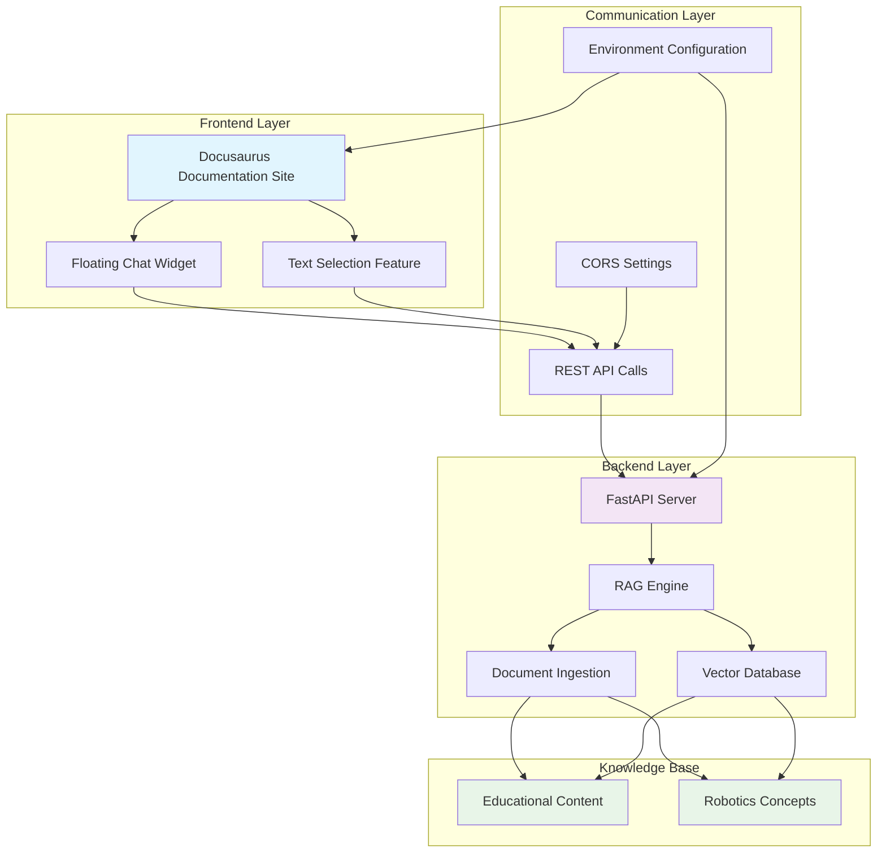
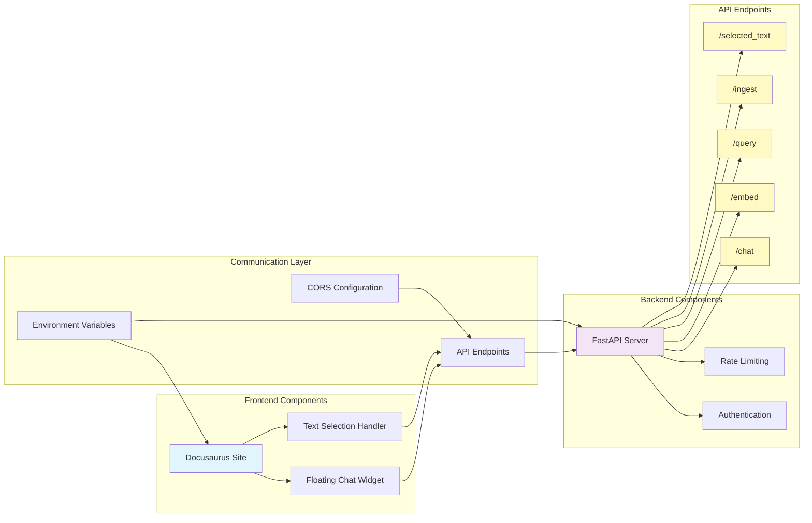
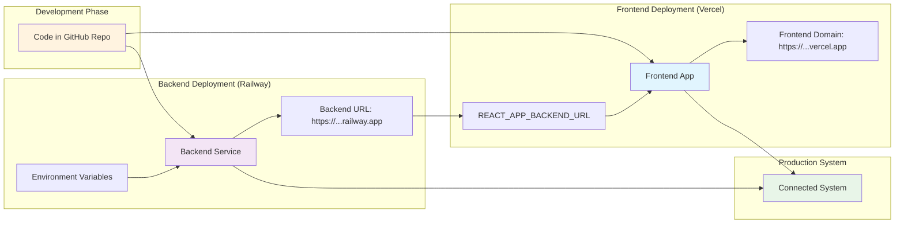

# Physical AI & Humanoid Robotics - Project Architecture

## Overview

This project implements an educational platform focused on Physical AI & Humanoid Robotics. The system combines traditional documentation with an interactive AI-powered chatbot that provides contextual answers about robotics concepts.

The architecture follows a modern web application pattern with a separation between the content delivery layer (frontend) and the AI processing layer (backend). This separation allows for:

- **Scalable Content Delivery**: Static documentation served through a performant frontend
- **Intelligent Interaction**: Dynamic Q&A capabilities powered by AI in the backend
- **Modular Development**: Independent development and deployment of frontend and backend components
- **Extensible Learning**: Ability to expand the knowledge base with additional robotics content

### Key Components Summary

- **Frontend**: Docusaurus-based documentation site with integrated chat interface
- **Backend**: FastAPI server providing RAG (Retrieval Augmented Generation) capabilities
- **Knowledge Base**: Embedded documentation content that the AI can reference
- **Interaction Layer**: Floating chat widget enabling real-time questions about content

This architecture enables students and developers to engage with robotics concepts through both traditional reading and interactive Q&A, creating a more comprehensive learning experience.

## Prerequisites

Before diving into the implementation and deployment of this architecture, ensure you have the following knowledge and tools:

### Technical Prerequisites
- **Python 3.8+**: Required for the backend FastAPI application
- **Node.js 16+**: Required for the Docusaurus frontend build process
- **Git**: For version control and deployment workflows
- **Basic understanding of REST APIs**: To understand the backend-endpoint interactions
- **Familiarity with containerization concepts**: Helpful for deployment (Docker knowledge recommended)

### Cloud Platform Accounts
- **Railway Account**: For backend deployment (free tier available)
- **Vercel Account**: For frontend deployment (free tier available)
- **GitHub Account**: For connecting deployment pipelines (if using automated deployment)

### Recommended Background Knowledge
- **Understanding of RAG Systems**: Familiarity with Retrieval Augmented Generation concepts
- **Basic AI/ML Concepts**: Understanding of embeddings and semantic search
- **Web Development Fundamentals**: Knowledge of frontend-backend communication patterns
- **Documentation Systems**: Experience with static site generators like Docusaurus

Having these prerequisites will help you better understand the architecture decisions and successfully implement the system.

## Architecture

The system is composed of two primary components that work together to provide an interactive learning experience. Understanding each component's role is essential for proper implementation and deployment.

### System Architecture Diagram



*System architecture showing the frontend, backend, and knowledge base components with their interactions.*

### Backend Service (`/backend`)

The backend service serves as the AI processing engine for the platform. It handles all intelligent operations including document processing, vector embeddings, and question answering.

#### Technology Stack
- **Framework**: FastAPI Python server for high-performance API operations
- **AI Integration**: RAG (Retrieval Augmented Generation) for contextual answers
- **Deployment**: Designed for cloud platforms like Railway for easy scaling

#### Core Functions
- **Document Processing**: Converts educational content into searchable knowledge base
- **Vector Embeddings**: Creates mathematical representations of content for similarity matching
- **Question Answering**: Provides contextual responses based on the knowledge base
- **Real-time Interaction**: Processes user queries and returns relevant information

#### API Endpoints
The backend exposes several RESTful endpoints to support the frontend functionality:

- **`/chat`** - Primary endpoint for interactive Q&A sessions about robotics concepts
  - Accepts user questions about robotics topics
  - Returns contextual answers based on the knowledge base
  - Supports conversation history for contextual responses

- **`/embed`** - Text embedding capabilities for content processing
  - Converts text documents into vector representations
  - Enables semantic search within the knowledge base
  - Powers the similarity matching for relevant content retrieval

- **`/query`** - Document search functionality for direct content access
  - Allows searching across the entire knowledge base
  - Returns relevant document segments based on query similarity
  - Supports filtering and ranking of search results

- **`/ingest`** - Document ingestion into knowledge base for content expansion
  - Processes new educational content for the system
  - Creates embeddings for new documents
  - Updates the knowledge base with fresh content

- **`/selected_text`** - Process selected text from documentation for context-aware queries
  - Handles text selection events from the frontend
  - Provides context-aware answers based on selected content
  - Integrates with the floating chat widget functionality

#### API Usage Examples

Here are practical examples of how to interact with the backend API endpoints:

#### Sample API Requests and Responses

**Chat Endpoint Request:**
```json
{
  "message": "What are the main components of a robotic arm?",
  "history": [
    {
      "role": "user",
      "content": "Can you explain forward kinematics?"
    },
    {
      "role": "assistant",
      "content": "Forward kinematics is the process of calculating the position and orientation of the end effector of a robotic arm based on the joint angles."
    }
  ],
  "context": "robotics,kinematics"
}
```

**Chat Endpoint Response:**
```json
{
  "response": "A robotic arm typically consists of several main components:\n\n1. **Joints** - Allow rotational or linear movement between segments\n2. **Links** - Rigid segments that connect the joints\n3. **Actuators** - Motors or other devices that drive the joints\n4. **End Effector** - The tool or gripper at the end of the arm\n5. **Sensors** - Provide feedback about position, force, etc.\n6. **Controller** - The system that coordinates the arm's movements",
  "sources": [
    {
      "title": "Robotics Components Guide",
      "url": "/docs/robotics/components",
      "relevance_score": 0.92
    }
  ],
  "conversation_id": "chat_abc123xyz"
}
```

**Query Endpoint Request:**
```json
{
  "query": "implementation of PID controller in ROS",
  "top_k": 3,
  "filters": {
    "category": "control-systems",
    "difficulty": "intermediate"
  }
}
```

**Query Endpoint Response:**
```json
{
  "results": [
    {
      "id": "doc_001",
      "title": "PID Controller Implementation in ROS",
      "content": "To implement a PID controller in ROS, you first need to create a PID object and configure its parameters...",
      "score": 0.89,
      "metadata": {
        "source": "ros_pid_guide.md",
        "category": "control-systems",
        "difficulty": "intermediate"
      }
    },
    {
      "id": "doc_002",
      "title": "Advanced PID Tuning Techniques",
      "content": "Ziegler-Nichols method is one of the most popular approaches for tuning PID controllers...",
      "score": 0.85,
      "metadata": {
        "source": "pid_tuning_advanced.md",
        "category": "control-systems",
        "difficulty": "advanced"
      }
    }
  ],
  "query_time": 0.124
}
```

#### API Code Examples

**Python Chat Endpoint Example:**
```python
import requests

# Example: Send a question to the chat endpoint
backend_url = "https://your-app.up.railway.app"  # Replace with your actual backend URL
question = {
    "message": "Explain the basics of inverse kinematics in robotics",
    "history": []  # Previous conversation history (optional)
}

response = requests.post(f"{backend_url}/chat", json=question)
chat_result = response.json()
print(f"Answer: {chat_result['response']}")
```

**JavaScript Query Endpoint Example:**
```javascript
// Example: Search the knowledge base for specific information
const backendUrl = "https://your-app.up.railway.app"; // Replace with your actual backend URL
const searchQuery = {
    "query": "PID controller implementation",
    "top_k": 5  // Return top 5 most relevant results
};

fetch(`${backendUrl}/query`, {
    method: 'POST',
    headers: {
        'Content-Type': 'application/json'
    },
    body: JSON.stringify(searchQuery)
})
.then(response => response.json())
.then(data => {
    console.log('Search results:', data.results);
});
```

**Bash Ingest Endpoint Example:**
```bash
# Example: Ingest new documentation content into the knowledge base
# Replace YOUR_BACKEND_URL with your actual backend URL
curl -X POST "https://your-app.up.railway.app/ingest" \
  -H "Content-Type: multipart/form-data" \
  -F "file=@robotics_guide.pdf" \
  -F "source=robotics_guide"
```

#### Deployment Considerations
- Designed for containerized deployment on cloud platforms
- Optimized for Railway deployment with appropriate resource allocation
- Supports environment-based configuration for different deployment stages

#### Backend Service Summary
The backend service acts as the AI processing engine for the educational platform, providing RAG capabilities that allow users to ask questions about robotics concepts. It handles document processing, vector embeddings, and question answering through a well-defined API. The service is designed for cloud deployment and includes proper security, error handling, and scalability considerations.

### Frontend Documentation Site (`/frontend/rag-chatbot-frontend`)

The frontend component provides the user interface for the educational platform, combining traditional documentation with AI-powered interaction capabilities.

#### Technology Stack
- **Framework**: Docusaurus React static site generator for optimized content delivery
- **UI Components**: Custom React components for interactive learning features
- **Deployment**: Static site hosting on platforms like Vercel for optimal performance

#### Core Features
- **Educational Content Delivery**: Serves structured documentation about robotics concepts
- **Interactive Learning Interface**: Combines reading with real-time Q&A capabilities
- **Context-Aware Interaction**: Allows users to ask questions about specific content sections
- **Responsive Design**: Works across different devices and screen sizes

#### Key Components
- **Course Content Documentation**: Traditional documentation pages with structured learning paths
- **Interactive Floating Chat Widget**: Always-available interface for asking questions
- **Text Selection Integration**: Allows users to select text and ask specific questions about it
- **Navigation System**: Organized content structure for systematic learning

#### Deployment Characteristics
- Static site generation for fast loading times
- CDN-friendly architecture for global content delivery
- Environment variable configuration for backend API connection

#### Frontend Documentation Site Summary
The frontend component serves as the user-facing interface for the educational platform, built with Docusaurus for optimal content delivery. It features an interactive chat widget, text selection capabilities, and a responsive design that works across devices. The frontend connects to the backend API to provide contextual answers about robotics concepts, creating an interactive learning experience that combines traditional documentation with AI-powered assistance.

## Integration

The frontend and backend components work together through a well-defined integration pattern that enables the interactive learning experience. Here's how the components connect and communicate:

### Connection Process

1. **Environment Configuration**: The frontend is configured with the backend API URL through environment variables during deployment
2. **Widget Initialization**: The floating chat widget initializes when the documentation page loads
3. **API Communication**: The widget communicates with the backend through REST API calls
4. **Context Awareness**: Text selection functionality allows users to ask questions about specific content

### Data Flow

The integration follows this data flow pattern:

1. **User Interaction**: User interacts with the floating chat widget or selects text in documentation
2. **Request Formation**: Frontend formats the request with necessary context and sends to backend
3. **Backend Processing**: Backend processes the request, accesses the knowledge base, and generates response
4. **Response Delivery**: Backend returns processed response to frontend
5. **User Presentation**: Frontend displays the response to the user in the chat interface

### Security Considerations

- **CORS Configuration**: Backend is configured to accept requests from the frontend domain
- **Rate Limiting**: API endpoints include rate limiting to prevent abuse
- **Request Validation**: All incoming requests are validated for security
- **Environment Variables**: Sensitive configuration is stored in environment variables, not in code

### Error Handling

- **Connection Failures**: Frontend gracefully handles backend connection issues
- **Timeout Management**: Requests have appropriate timeout values
- **Fallback Messages**: Clear error messages are shown to users when issues occur
- **Retry Logic**: Automatic retry mechanisms for transient failures

### Frontend-Backend Integration Diagram



*Integration diagram showing the connection points between frontend and backend components.*

## Recommended Deployment

Follow these detailed steps to deploy the system to production. The deployment process involves setting up the backend first, then configuring the frontend to connect to it.

### Pre-Deployment Checklist

Before starting the deployment process, ensure you have:

- [ ] Created accounts on Railway and Vercel
- [ ] Prepared your GitHub repository with the latest code
- [ ] Decided on custom domain names (optional)
- [ ] Set up proper environment variables for production

### Backend Deployment to Railway

1. **Prepare for Deployment**
   - Ensure your backend code is in the `/backend` directory
   - Verify the Dockerfile is properly configured
   - Commit all changes to your GitHub repository

2. **Connect to Railway**
   - Visit [Railway](https://railway.app) and sign in
   - Connect your GitHub repository to Railway
   - Select the `backend` directory as the root for this service

3. **Configure Environment Variables** (if needed)
   - Set any required environment variables in Railway dashboard
   - Ensure proper configuration for your specific deployment needs

4. **Deploy the Backend**
   - Railway will automatically detect the Python application
   - The build process will run automatically
   - Monitor the deployment logs for any issues

5. **Note Your Backend URL**
   - After successful deployment, Railway will provide a URL like: `https://your-app-name.up.railway.app`
   - Save this URL as you'll need it for frontend configuration
   - Test the backend endpoints to ensure they're working

### Frontend Deployment to Vercel

1. **Prepare for Deployment**
   - Ensure your frontend code is in `/frontend/rag-chatbot-frontend` directory
   - The project is already configured for Vercel deployment
   - Verify that baseUrl is set to `/` for root deployment

2. **Connect to Vercel**
   - Visit [Vercel](https://vercel.com) and sign in
   - Connect your GitHub repository to Vercel
   - Create a new project for the frontend

3. **Configure Build Settings**
   - Set the root directory to: `frontend/rag-chatbot-frontend`
   - Build Command: `npm run build`
   - Output Directory: `build`
   - Install Command: `npm install`

4. **Set Environment Variables**
   - Add the following environment variable:
     - **Key**: `REACT_APP_BACKEND_URL`
     - **Value**: Your Railway backend URL from the previous section
   - This connects the frontend to your deployed backend API

5. **Deploy the Frontend**
   - Vercel will automatically build and deploy your site
   - Monitor the deployment process for any errors
   - Note your Vercel domain URL for the next step

6. **Final Configuration**
   - After deployment, update the `url` field in `docusaurus.config.ts` with your Vercel domain
   - This ensures proper canonical URLs and SEO settings

### Post-Deployment Verification

1. **Test Backend Connection**
   - Visit your frontend URL
   - The floating chat widget should connect to your backend
   - Verify that basic functionality works

2. **Test Interactive Features**
   - Try asking questions through the chat widget
   - Test the text selection feature to ask about specific content
   - Verify that responses are contextually relevant

3. **Performance Check**
   - Ensure the site loads quickly
   - Verify that the chat widget responds in a timely manner
   - Check that all links and navigation work correctly

### Post-Deployment Verification

1. **Test Backend Connection**
   - Visit your frontend URL
   - The floating chat widget should connect to your backend
   - Verify that basic functionality works

2. **Test Interactive Features**
   - Try asking questions through the chat widget
   - Test the text selection feature to ask about specific content
   - Verify that responses are contextually relevant

3. **Performance Check**
   - Ensure the site loads quickly
   - Verify that the chat widget responds in a timely manner
   - Check that all links and navigation work correctly

### Troubleshooting Common Issues

- **Chat Widget Not Connecting**: Verify that `REACT_APP_BACKEND_URL` is correctly set and accessible
- **Slow Response Times**: Check backend performance and consider scaling options
- **Deployment Failures**: Review build logs in Railway/Vercel dashboard for specific error messages

### Deployment Summary
The deployment process involves setting up the backend service first on Railway, followed by the frontend on Vercel. The process includes proper environment configuration, build settings, and post-deployment verification to ensure the complete system functions correctly. With the proper configuration, the system will provide a seamless interactive learning experience combining documentation with AI-powered Q&A capabilities.

### Integration Summary
The integration between frontend and backend components enables the core interactive learning experience of the platform. Through well-defined API endpoints, environment configuration, and security measures, the system provides seamless communication between the documentation interface and the AI processing engine. The integration includes proper error handling, security considerations, and performance optimizations to ensure a smooth user experience.

### Deployment Flow Diagram



*Deployment flow diagram showing the process from development to connected production system.*

## Development

The development environment allows you to work on both components simultaneously. Follow these steps to set up and run the development environment.

### Prerequisites for Development

Before starting development, ensure you have:

- Python 3.8+ installed with pip package manager
- Node.js 16+ and npm installed
- Git for version control
- A code editor of your choice
- Basic familiarity with command line tools

### Backend Development Setup

1. **Navigate to Backend Directory**
   ```bash
   cd backend
   ```

2. **Install Python Dependencies**
   ```bash
   pip install -r requirements.txt
   # Or if using a virtual environment:
   python -m venv venv
   source venv/bin/activate  # On Windows: venv\Scripts\activate
   pip install -r requirements.txt
   ```

3. **Set Up Environment Variables**
   - Create a `.env` file in the backend directory
   - Add any required environment variables (API keys, database URLs, etc.)

   **Complete Backend Environment Variables Example:**
   ```env
   # API Keys and Services
   OPENAI_API_KEY=sk-your-openai-api-key-here
   ANTHROPIC_API_KEY=your-anthropic-api-key-here  # Optional, for alternative AI provider

   # Database Configuration
   DATABASE_URL=postgresql://localhost/robotics_db
   REDIS_URL=redis://localhost:6379  # Optional, for caching

   # Application Settings
   ENVIRONMENT=development
   LOG_LEVEL=INFO
   CORS_ORIGINS=http://localhost:3000,http://localhost:8000

   # Vector Database (for embeddings)
   QDRANT_HOST=localhost
   QDRANT_PORT=6333

   # Optional: Cloud Storage for document uploads
   AWS_ACCESS_KEY_ID=your-aws-access-key
   AWS_SECRET_ACCESS_KEY=your-aws-secret-key
   AWS_S3_BUCKET=your-document-bucket
   ```

4. **Start the Backend Server**
   ```bash
   python app.py
   # Or using uvicorn for hot reload during development:
   uvicorn main:app --reload --port 8000
   ```

5. **Verify Backend is Running**
   - Open your browser and navigate to `http://localhost:8000`
   - Check the `/docs` endpoint for API documentation
   - Verify that all endpoints are accessible

### Frontend Development Setup

1. **Navigate to Frontend Directory**
   ```bash
   cd frontend/rag-chatbot-frontend
   ```

2. **Install Node Dependencies**
   ```bash
   npm install
   # Or using yarn:
   yarn install
   ```

3. **Configure Environment Variables**
   - Create a `.env` file in the frontend directory
   - Set the backend URL for development:

   **Complete Frontend Environment Variables Example:**
   ```env
   # Backend API Configuration
   REACT_APP_BACKEND_URL=http://localhost:8000
   REACT_APP_API_TIMEOUT=30000  # 30 seconds timeout for API calls

   # Application Settings
   REACT_APP_ENVIRONMENT=development
   REACT_APP_LOG_LEVEL=info

   # Feature Flags
   REACT_APP_CHAT_WIDGET_ENABLED=true
   REACT_APP_TEXT_SELECTION_ENABLED=true
   REACT_APP_ANALYTICS_ENABLED=false

   # Optional: Analytics and Monitoring
   REACT_APP_GA_MEASUREMENT_ID=G-XXXXXXXXXX  # Google Analytics
   REACT_APP_SENTRY_DSN=https://your-sentry-dsn  # Error tracking
   ```
   - This connects the frontend to your local backend during development

4. **Start the Frontend Development Server**
   ```bash
   npm start
   # This will typically start on http://localhost:3000
   ```

5. **Verify Frontend is Running**
   - The application should open automatically in your default browser
   - Check that the chat widget is connecting to your backend
   - Verify that all pages load correctly

### Running Both Components Simultaneously

Since the system requires both backend and frontend to function properly, you have several options:

#### Option 1: Separate Terminals (Recommended)
1. Open one terminal and start the backend: `cd backend && python app.py`
2. Open another terminal and start the frontend: `cd frontend/rag-chatbot-frontend && npm start`
3. Both servers will run simultaneously without interfering with each other

#### Option 2: Background Process for Backend
1. Start backend in background: `cd backend && python app.py &`
2. Start frontend in the same terminal: `cd frontend/rag-chatbot-frontend && npm start`

#### Option 3: Using a Process Manager
Consider using tools like `concurrently` or `nodemon` to manage both processes from a single command.

### Development Best Practices

- **API Testing**: Use the backend's `/docs` endpoint to test API calls during development
- **Environment Consistency**: Keep development, staging, and production environments as similar as possible
- **Hot Reloading**: Take advantage of hot reload features to see changes immediately
- **Logging**: Enable appropriate logging levels to help debug issues
- **Version Control**: Commit changes frequently with descriptive commit messages
- **Code Quality**: Follow established code style guides and run linters/formatters before committing

### Troubleshooting Development Issues

- **Port Conflicts**: If ports 8000 (backend) or 3000 (frontend) are in use, modify the startup commands
- **Environment Variables**: Ensure all required environment variables are set for both components
- **Dependency Issues**: Clear caches (`npm cache clean --force`, `pip cache purge`) if experiencing dependency problems
- **Cross-Origin Issues**: Verify that CORS settings allow communication between frontend and backend during development

### Development Summary
The development environment setup allows for efficient work on both frontend and backend components. With proper environment configuration and understanding of the development workflow, developers can effectively build, test, and iterate on the educational platform. The recommended practices and troubleshooting tips help ensure a smooth development experience.

## Key Takeaways

This architecture document outlines a comprehensive educational platform that combines traditional documentation with AI-powered interactive learning. Here are the key points to remember:

### Core Components
- **Backend**: FastAPI server providing RAG (Retrieval Augmented Generation) capabilities for intelligent Q&A
- **Frontend**: Docusaurus-based documentation site with integrated chat interface
- **Integration**: Seamless connection between frontend and backend for contextual answers

### Architecture Benefits
- **Scalable**: Separation of content delivery and AI processing allows independent scaling
- **Interactive**: Real-time Q&A capabilities enhance traditional learning methods
- **Extensible**: Easy to add new content and expand the knowledge base
- **Accessible**: Works across devices with responsive design

### Implementation Considerations
- **Development**: Requires Python/Node.js knowledge and understanding of API integration
- **Deployment**: Designed for cloud platforms (Railway/Vercel) with environment-based configuration
- **Maintenance**: Includes proper logging, monitoring, and error handling

This architecture enables an innovative approach to educational content delivery, combining the best of traditional documentation with modern AI capabilities to create an interactive learning experience for robotics concepts.