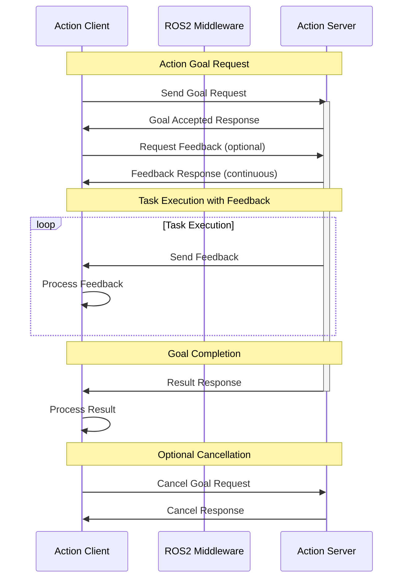
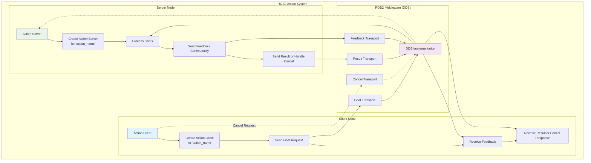
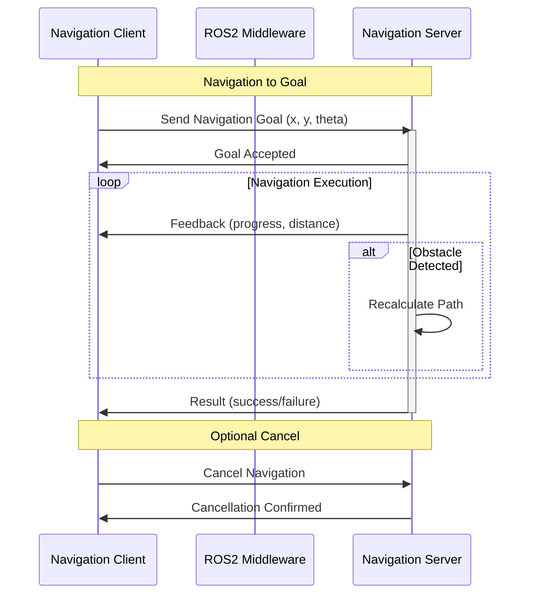
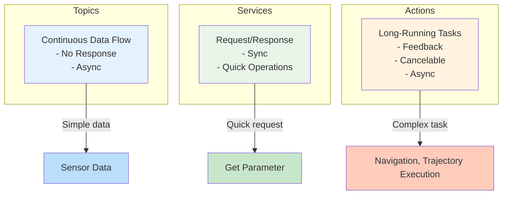

# Action Workflow Diagram

This diagram illustrates the workflow of ROS2 actions, which are used for long-running tasks that may provide feedback and can be canceled.



## Action Architecture



## Action States and Transitions

```mermaid
stateDiagram-v2
    [*] --> PENDING : Goal Sent
    PENDING --> ACTIVE : Goal Accepted
    ACTIVE --> EXECUTING : Goal Processing
    EXECUTING --> SUCCEEDED : Task Completed
    EXECUTING --> CANCELLED : Goal Cancelled
    EXECUTING --> ABORTED : Task Failed
    PENDING --> RECALLING : Goal Recalled
    ACTIVE --> RECALLING : Goal Recalled
    RECALLING --> RECALLED : Goal Recalled
    CANCELLED --> [*]
    SUCCEEDED --> [*]
    ABORTED --> [*]
    RECALLED --> [*]

    note right of EXECUTING
        Feedback sent
        continuously during
        execution
    end
```

## Real-World Action Example: Navigation



## Action vs Service vs Topic Comparison



This diagram shows how actions in ROS2 provide a sophisticated communication pattern for long-running tasks that require feedback, progress updates, and the ability to be canceled, making them ideal for robot navigation, manipulation, and other complex operations.