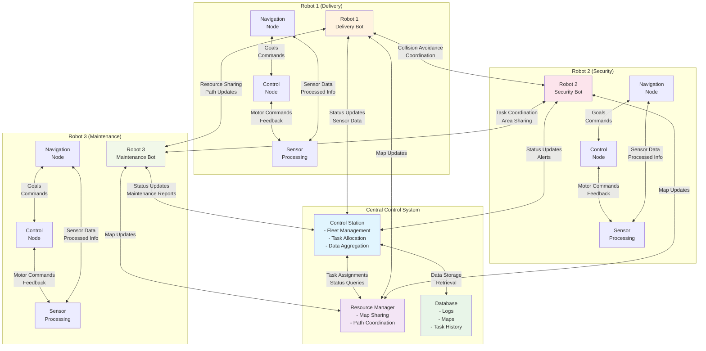
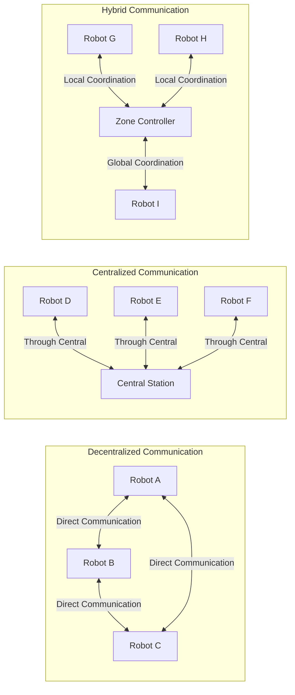
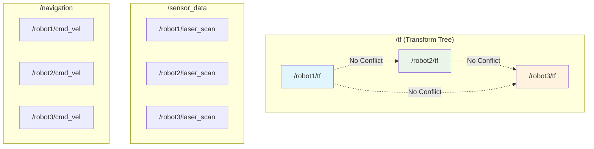
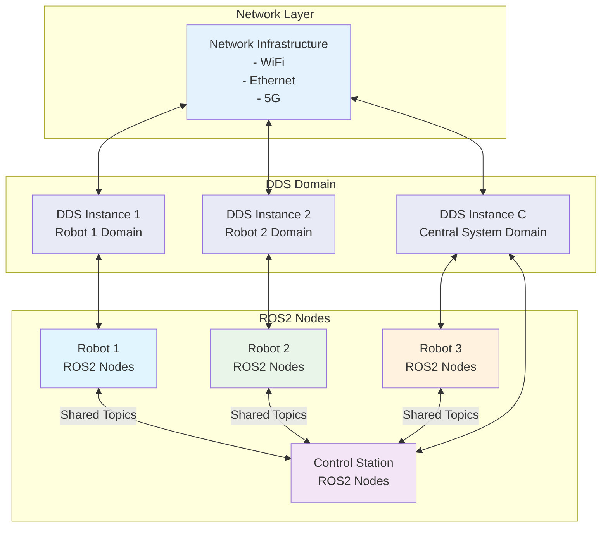
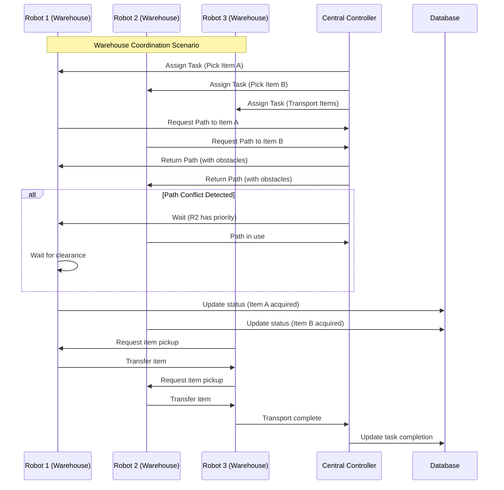

# Multi-Robot Communication Graph Diagram

This diagram illustrates how multiple robots can communicate with each other and with centralized systems in a ROS2 environment.

## Multi-Robot Communication Patterns

## Namespace Organization in Multi-Robot Systems

## Communication Middleware Architecture

## Real-World Multi-Robot Scenario

This diagram shows how multiple robots can effectively communicate in a ROS2 environment using proper namespacing, centralized coordination, and appropriate communication patterns to avoid conflicts while maintaining efficient operation.