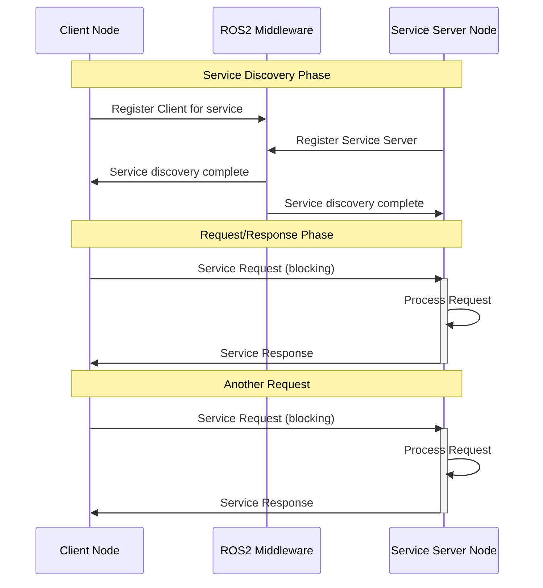
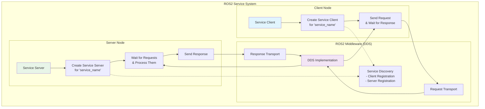
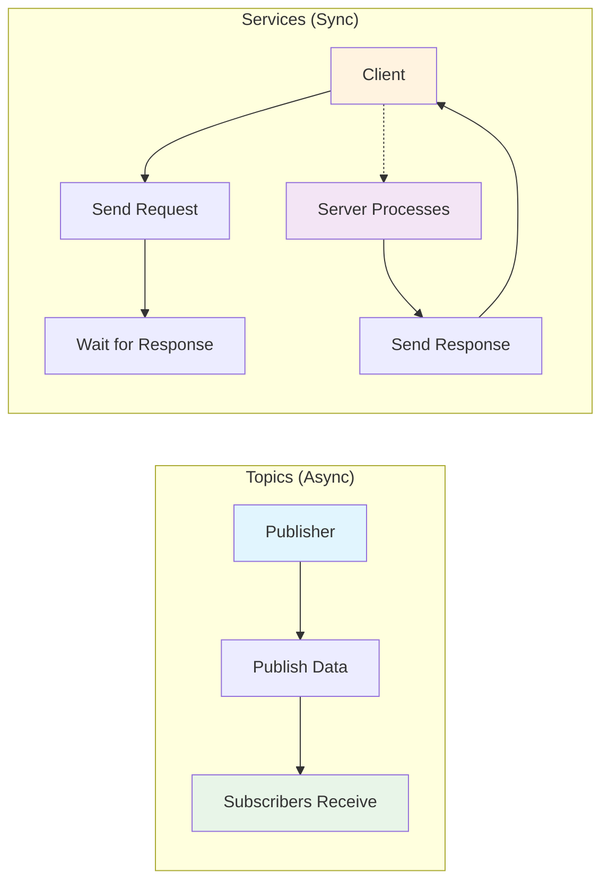
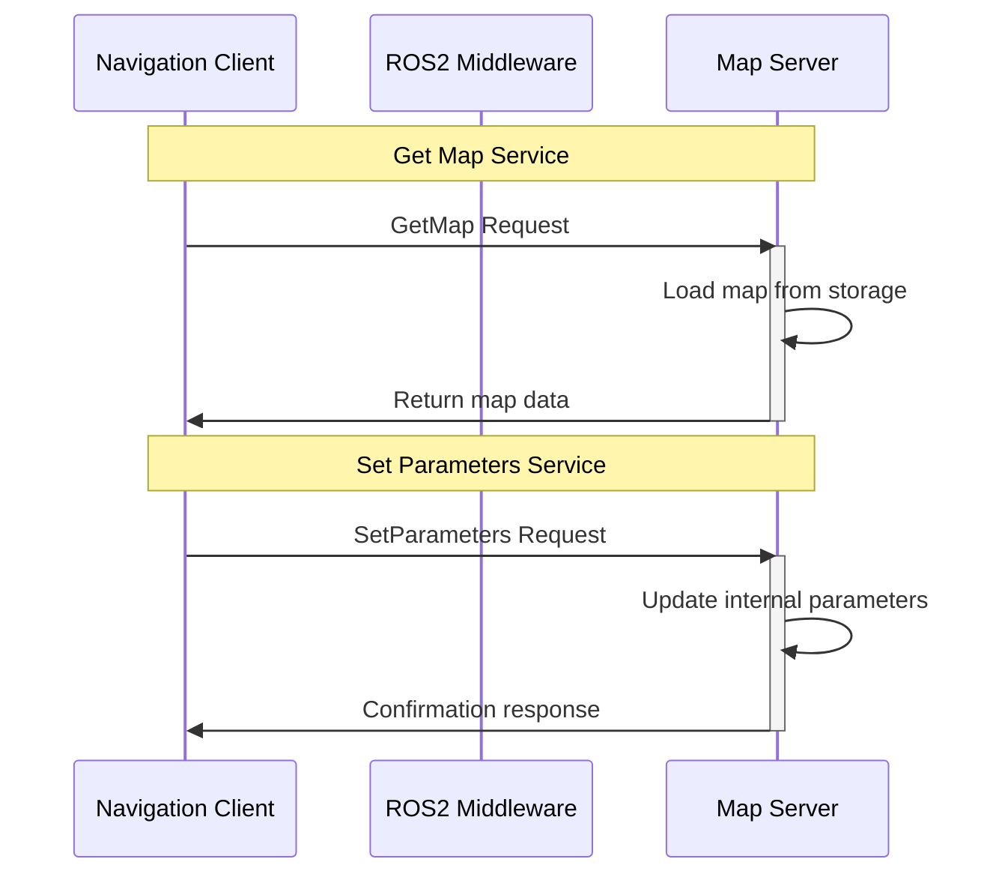

# Service Handshake Diagram

This diagram illustrates the request/response communication pattern in ROS2 using services.

## Service Communication Process

1. **Service Discovery**: Server registers service, client discovers it
2. **Request Initiation**: Client sends request to server
3. **Request Processing**: Server processes the request
4. **Response Delivery**: Server sends response back to client
5. **Synchronous Wait**: Client waits for response (blocking)

## Service Architecture

## Service vs Topic Comparison

## Real-World Service Example

This diagram shows how services provide synchronous request/response communication in ROS2, which is ideal for operations that need a guaranteed response, such as getting robot state, setting parameters, or triggering specific actions.