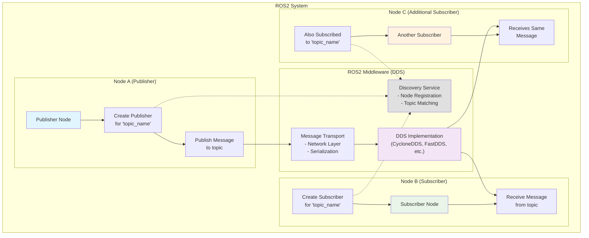
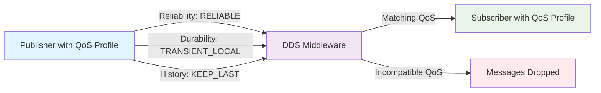
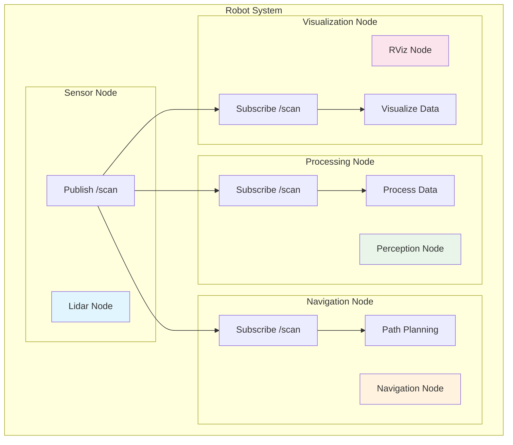

# Topic Communication Flow Diagram

This diagram illustrates the communication flow between publishers and subscribers in ROS2 using topics.

## Topic Communication Process

1. **Node Creation**: Publisher and subscriber nodes are created
2. **Entity Creation**: Nodes create publishers/subscribers for specific topics
3. **Discovery**: ROS2 discovery mechanism matches publishers with subscribers
4. **Message Publishing**: Publisher sends messages to the topic
5. **Middleware Transport**: DDS handles message transport and delivery
6. **Message Reception**: All subscribers receive copies of the message
7. **Callback Execution**: Subscribers process received messages

## Quality of Service (QoS) Considerations

The communication flow can be affected by QoS settings:

## Multi-Node Topic Communication

This diagram shows how a single publisher can send messages to multiple subscribers simultaneously, demonstrating the publish-subscribe pattern that makes ROS2 ideal for distributed robotic systems.