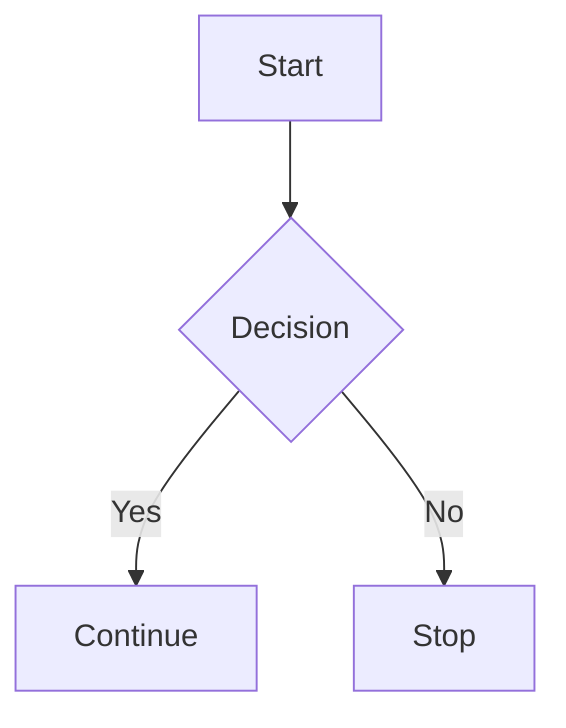
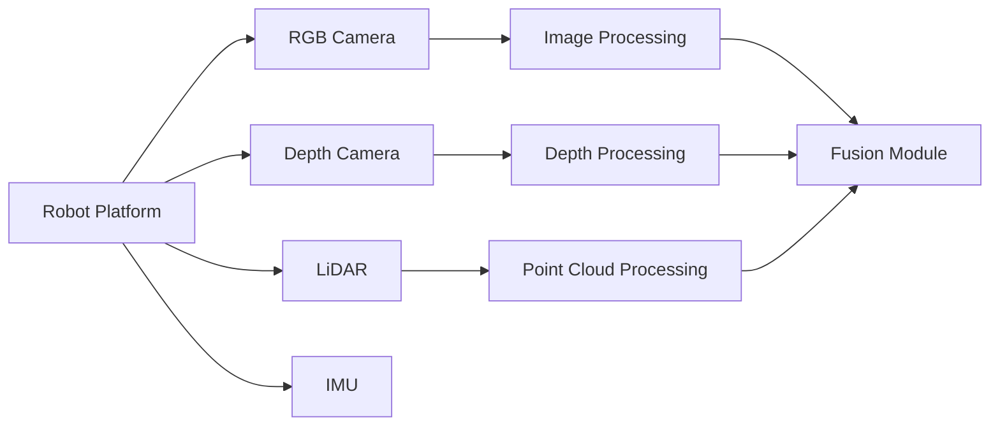

# Mermaid Diagram Setup for Documentation

## Docusaurus Mermaid Integration

To enable Mermaid diagram support in Docusaurus, follow these steps:

### 1. Install Mermaid Plugin

Add the Mermaid plugin to your Docusaurus configuration:

```bash
npm install @docusaurus/plugin-ideal-image
npm install rehype-katex
npm install remark-math
```

### 2. Configure Docusaurus

Update your `docusaurus.config.js`:

```javascript
module.exports = {
  // ...
  plugins: [
    [
      '@docusaurus/plugin-content-docs',
      {
        id: 'module-2',
        path: 'docs/module-2',
        routeBasePath: 'module-2',
        editUrl: 'https://github.com/your-org/your-repo/edit/main/',
        remarkPlugins: [require('remark-math')],
        rehypePlugins: [require('rehype-katex')],
      },
    ],
    [
      'docusaurus-plugin-matrx',
      {
        // Enable Mermaid diagrams
        mermaid: true,
      },
    ],
  ],
  themes: [
    '@docusaurus/theme-mermaid', // Add this for Mermaid support
  ],
  // ...
};
```

### 3. Using Mermaid in Markdown

You can now use Mermaid diagrams in your Markdown files:



### 4. Example Diagram Syntax

For sensor layout diagrams:



### 5. Editor Configuration

For VS Code, install the following extensions:
- "Markdown Preview Mermaid Support"
- "Docusaurus Tools"
- "Markdownlint"

This will provide syntax highlighting and live preview for Mermaid diagrams in your Markdown files.