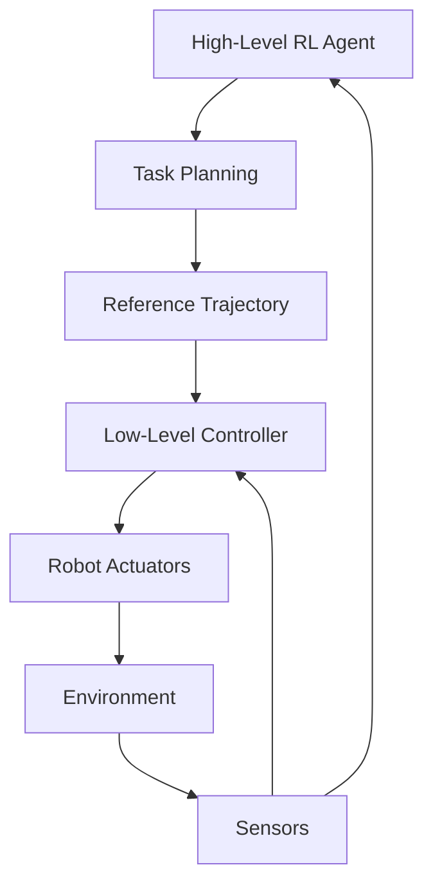

# Control Integration: Combining RL with Traditional Control

## Introduction

While Reinforcement Learning offers powerful learning capabilities, real-world robotics applications often benefit from combining learning-based approaches with traditional control methods. This hybrid approach leverages the stability and predictability of classical control with the adaptability of machine learning.

## Hybrid Control Architectures

### Hierarchical Control Structure

A common approach is to use RL at higher levels for decision-making and traditional controllers at lower levels for precise execution:



### Architecture Example: RL for High-Level Decisions, PID for Low-Level Control

```python
import numpy as np
import torch
import torch.nn as nn

class HighLevelRLAgent(nn.Module):
    def __init__(self, state_dim, action_dim):
        super(HighLevelRLAgent, self).__init__()

        self.network = nn.Sequential(
            nn.Linear(state_dim, 128),
            nn.ReLU(),
            nn.Linear(128, 128),
            nn.ReLU(),
            nn.Linear(128, action_dim),
            nn.Softmax(dim=-1)
        )

    def forward(self, state):
        return self.network(state)

class PIDController:
    def __init__(self, kp=1.0, ki=0.0, kd=0.0, dt=0.01):
        self.kp = kp
        self.ki = ki
        self.kd = kd
        self.dt = dt
        self.prev_error = 0
        self.integral = 0

    def compute(self, error):
        # Proportional term
        p_term = self.kp * error

        # Integral term
        self.integral += error * self.dt
        i_term = self.ki * self.integral

        # Derivative term
        derivative = (error - self.prev_error) / self.dt
        d_term = self.kd * derivative

        # Update previous error
        self.prev_error = error

        # Compute output
        output = p_term + i_term + d_term
        return output

class HybridControlSystem:
    def __init__(self, rl_state_dim, rl_action_dim):
        # High-level RL agent
        self.rl_agent = HighLevelRLAgent(rl_state_dim, rl_action_dim)

        # Low-level PID controllers for each joint/dof
        self.pid_controllers = [PIDController(kp=10, ki=1, kd=0.1) for _ in range(6)]

        # Action mapping from RL to PID references
        self.action_mapping = np.eye(rl_action_dim)

    def compute_control(self, high_level_state, current_state, desired_states):
        """
        Compute control using hybrid approach:
        - RL determines high-level strategy
        - PID executes low-level tracking
        """
        # Get high-level action from RL agent
        with torch.no_grad():
            high_level_action = self.rl_agent(torch.FloatTensor(high_level_state))
            high_level_action = high_level_action.numpy()

        # Map high-level action to reference signals for PID controllers
        reference_signals = self.action_mapping @ high_level_action

        # Compute PID control for each DOF
        control_outputs = []
        for i, pid in enumerate(self.pid_controllers):
            if i < len(desired_states) and i < len(current_state):
                error = desired_states[i] - current_state[i]
                control_output = pid.compute(error)
                control_outputs.append(control_output)
            else:
                control_outputs.append(0.0)

        return np.array(control_outputs), reference_signals

# Example: Mobile robot navigation with hybrid control
class MobileRobotHybridController:
    def __init__(self):
        # RL agent for path planning decisions
        self.rl_agent = HighLevelRLAgent(state_dim=8, action_dim=4)  # 8 state features, 4 discrete actions

        # PID controllers for velocity control
        self.linear_pid = PIDController(kp=2.0, ki=0.1, kd=0.05)
        self.angular_pid = PIDController(kp=1.5, ki=0.05, kd=0.03)

    def navigate(self, robot_state, goal_position, obstacles):
        """
        robot_state: [x, y, theta, v, omega, goal_x, goal_y, obstacle_distance]
        """
        # High-level decision: where to go next (discrete action space)
        with torch.no_grad():
            rl_action = self.rl_agent(torch.FloatTensor(robot_state))
            rl_action_idx = torch.argmax(rl_action).item()

        # Map RL action to velocity reference
        action_to_vel = {
            0: (0.5, 0.0),    # Move forward
            1: (-0.2, 0.0),   # Move backward
            2: (0.0, 0.5),    # Turn left
            3: (0.0, -0.5)    # Turn right
        }

        ref_linear, ref_angular = action_to_vel[rl_action_idx]

        # Low-level PID control to achieve desired velocities
        current_linear, current_angular = robot_state[3], robot_state[4]

        linear_error = ref_linear - current_linear
        angular_error = ref_angular - current_angular

        linear_control = self.linear_pid.compute(linear_error)
        angular_control = self.angular_pid.compute(angular_error)

        return linear_control, angular_control
```

## Learning-Based PID Tuning

Instead of manually tuning PID parameters, RL can learn optimal parameters:

```python
class LearnablePID(nn.Module):
    def __init__(self, initial_kp=1.0, initial_ki=0.1, initial_kd=0.05):
        super(LearnablePID, self).__init__()

        # Learnable PID parameters
        self.log_kp = nn.Parameter(torch.log(torch.tensor(initial_kp)))
        self.log_ki = nn.Parameter(torch.log(torch.tensor(initial_ki)))
        self.log_kd = nn.Parameter(torch.log(torch.tensor(initial_kd)))

        # Internal state
        self.integral = 0.0
        self.prev_error = 0.0

    def forward(self, error, dt=0.01):
        kp = torch.exp(self.log_kp)
        ki = torch.exp(self.log_ki)
        kd = torch.exp(self.log_kd)

        # Update integral and derivative terms
        self.integral += error * dt
        derivative = (error - self.prev_error) / dt
        self.prev_error = error

        # Compute control output
        output = kp * error + ki * self.integral + kd * derivative
        return output

class PIDTuningAgent:
    def __init__(self, state_dim, action_dim=3):  # kp, ki, kd
        # Policy network to output PID parameters
        self.policy = nn.Sequential(
            nn.Linear(state_dim, 64),
            nn.ReLU(),
            nn.Linear(64, 64),
            nn.ReLU(),
            nn.Linear(64, action_dim),
            nn.Softplus()  # Ensures positive parameters
        )

    def get_pid_params(self, state):
        state_tensor = torch.FloatTensor(state)
        params = self.policy(state_tensor)
        kp, ki, kd = params[0].item(), params[1].item(), params[2].item()
        return kp, ki, kd

# Example: Adaptive PID tuning for robot arm
class AdaptivePIDRobotArm:
    def __init__(self):
        self.pid_agent = PIDTuningAgent(state_dim=10)  # 10 state features
        self.joint_pids = [LearnablePID() for _ in range(6)]  # 6 DOF arm

    def control_step(self, joint_errors, joint_velocities, external_loads):
        """
        Adapt PID parameters based on current state
        """
        # State vector: [joint_errors, joint_velocities, external_loads, ...]
        state = np.concatenate([joint_errors, joint_velocities, external_loads])

        # Get adaptive PID parameters for each joint
        for i, pid in enumerate(self.joint_pids):
            if i < len(joint_errors):
                control_output = pid(joint_errors[i])
                # Apply control to joint
                # (implementation would interface with robot hardware)
```

## Model Predictive Control with Learning

Model Predictive Control (MPC) can be enhanced with learned models:

```python
import numpy as np
from scipy.optimize import minimize

class LearnedDynamicsModel(nn.Module):
    def __init__(self, state_dim, action_dim, hidden_dim=64):
        super(LearnedDynamicsModel, self).__init__()

        self.network = nn.Sequential(
            nn.Linear(state_dim + action_dim, hidden_dim),
            nn.ReLU(),
            nn.Linear(hidden_dim, hidden_dim),
            nn.ReLU(),
            nn.Linear(hidden_dim, state_dim)  # Predict next state
        )

    def forward(self, state, action):
        combined = torch.cat([state, action], dim=-1)
        return self.network(combined)

class LearningMPC:
    def __init__(self, state_dim, action_dim, horizon=10, dt=0.01):
        self.state_dim = state_dim
        self.action_dim = action_dim
        self.horizon = horizon
        self.dt = dt

        # Learned dynamics model
        self.dynamics_model = LearnedDynamicsModel(state_dim, action_dim)

        # MPC parameters
        self.Q = torch.eye(state_dim) * 1.0  # State cost matrix
        self.R = torch.eye(action_dim) * 0.1  # Action cost matrix

    def predict_trajectory(self, initial_state, action_sequence):
        """
        Predict state trajectory given initial state and action sequence
        """
        state = initial_state.clone()
        trajectory = [state]

        for action in action_sequence:
            next_state = self.dynamics_model(state, action)
            trajectory.append(next_state)
            state = next_state

        return trajectory

    def compute_cost(self, trajectory, reference_trajectory):
        """
        Compute total cost for a trajectory
        """
        total_cost = 0.0

        for state, ref_state in zip(trajectory, reference_trajectory):
            state_error = state - ref_state
            cost = torch.dot(state_error, torch.mv(self.Q, state_error))
            total_cost += cost

        return total_cost

    def optimize_control(self, current_state, reference_trajectory):
        """
        Optimize control sequence using the learned model
        """
        def objective(action_sequence_flat):
            # Reshape flat action sequence
            actions = torch.FloatTensor(action_sequence_flat).reshape(self.horizon, self.action_dim)

            # Predict trajectory
            trajectory = self.predict_trajectory(current_state, actions)

            # Compute cost
            cost = self.compute_cost(trajectory, reference_trajectory)
            return cost.item()

        # Initial guess for action sequence
        initial_actions = np.zeros(self.horizon * self.action_dim)

        # Optimize
        result = minimize(objective, initial_actions, method='L-BFGS-B')

        # Return first action (MPC receding horizon)
        optimal_actions = result.x.reshape(self.horizon, self.action_dim)
        return optimal_actions[0]  # Return first action

# Example usage
def example_learning_mpc():
    mpc = LearningMPC(state_dim=6, action_dim=3, horizon=10)  # 6D state, 3D action

    current_state = torch.FloatTensor([1.0, 0.5, 0.0, 0.0, 0.0, 0.0])
    reference_trajectory = [torch.FloatTensor([0.0, 0.0, 0.0, 0.0, 0.0, 0.0]) for _ in range(11)]

    optimal_action = mpc.optimize_control(current_state, reference_trajectory)
    print(f"Optimal action: {optimal_action}")
```

## Safety and Stability Guarantees

When combining RL with traditional control, ensuring safety and stability is crucial:

```python
class SafeRLController:
    def __init__(self, nominal_controller, safety_filter=None):
        self.nominal_controller = nominal_controller  # Traditional controller
        self.safety_filter = safety_filter  # Safety filter to ensure constraints
        self.backup_controller = None  # Backup controller for safety
        self.safe_set = None  # Set of safe states

    def compute_control(self, state, reference):
        # Compute nominal control from traditional controller
        nominal_control = self.nominal_controller.compute(state, reference)

        # Compute RL-based control (if available)
        rl_control = self.rl_controller.compute(state, reference) if hasattr(self, 'rl_controller') else None

        # Combine controls (e.g., weighted combination)
        if rl_control is not None:
            combined_control = 0.7 * rl_control + 0.3 * nominal_control
        else:
            combined_control = nominal_control

        # Apply safety filter to ensure constraints are satisfied
        if self.safety_filter:
            safe_control = self.safety_filter.apply(combined_control, state)
        else:
            safe_control = combined_control

        # Check if in safe set
        if self.safe_set and not self.safe_set.contains(state):
            # Switch to backup controller if unsafe
            safe_control = self.backup_controller.compute(state, reference)

        return safe_control

class ControlBarrierFunction:
    def __init__(self, safe_set_boundary):
        self.safe_set_boundary = safe_set_boundary  # Function defining safe set

    def compute_barrier(self, state):
        """
        Compute control barrier function value
        h(x) >= 0 means state is safe
        """
        return self.safe_set_boundary(state)

    def compute_control_filter(self, control_input, state, alpha_gain=1.0):
        """
        Filter control input to maintain safety
        """
        h = self.compute_barrier(state)

        # If unsafe, modify control to restore safety
        if h < 0:
            # Project control to maintain safety constraint
            filtered_control = control_input - alpha_gain * min(0, h)
        else:
            filtered_control = control_input

        return filtered_control
```

## Transfer Learning for Control

Transfer learned policies to new but similar control tasks:

```python
class TransferableRLController:
    def __init__(self, source_task_model, target_task_adapter=None):
        self.source_policy = source_task_model
        self.target_adapter = target_adapter or nn.Identity()

        # Freeze source policy parameters
        for param in self.source_policy.parameters():
            param.requires_grad = False

    def adapt_policy(self, target_env, adaptation_steps=1000):
        """
        Adapt source policy to target environment
        """
        # Add trainable adapter layers
        self.target_adapter = nn.Sequential(
            nn.Linear(self.source_policy.state_dim, 64),
            nn.ReLU(),
            nn.Linear(64, 64),
            nn.ReLU(),
            nn.Linear(64, self.source_policy.action_dim)
        )

        # Fine-tune adapter with target environment
        optimizer = torch.optim.Adam(self.target_adapter.parameters(), lr=1e-4)

        for step in range(adaptation_steps):
            # Collect experience from target environment
            state = target_env.reset()
            total_reward = 0

            for _ in range(100):  # Episode length
                # Get action from adapted policy
                source_action = self.source_policy(torch.FloatTensor(state))
                adapted_action = self.target_adapter(source_action)

                next_state, reward, done, _ = target_env.step(adapted_action.numpy())
                state = next_state
                total_reward += reward

                if done:
                    break

        return self.target_adapter
```

## Implementation Considerations

### Real-Time Constraints

```python
import time

class RealTimeRLController:
    def __init__(self, control_frequency=100):  # 100 Hz
        self.control_period = 1.0 / control_frequency
        self.last_control_time = time.time()

    def compute_control_with_timing(self, state, reference):
        current_time = time.time()
        elapsed = current_time - self.last_control_time

        if elapsed >= self.control_period:
            # Compute control action
            control_output = self.compute_control(state, reference)

            # Update timing
            self.last_control_time = current_time

            return control_output
        else:
            # Return previous control or zero
            return self.last_control_output if hasattr(self, 'last_control_output') else 0.0
```

### Hardware-In-the-Loop Training

```python
class HardwareInLoopTrainer:
    def __init__(self, sim_env, real_robot_interface):
        self.sim_env = sim_env
        self.real_robot = real_robot_interface
        self.sim_to_real_ratio = 10  # Train 10 sim steps per real step

    def train_with_hardware(self, agent, episodes=1000):
        for episode in range(episodes):
            # Initialize both sim and real environments
            sim_state = self.sim_env.reset()
            real_state = self.real_robot.reset()

            for step in range(1000):  # Max steps per episode
                # Use sim for most training steps
                for _ in range(self.sim_to_real_ratio - 1):
                    action = agent.act(sim_state)
                    sim_state, reward, done, _ = self.sim_env.step(action)
                    agent.learn(sim_state, action, reward, done)

                # Use real robot occasionally for reality check
                action = agent.act(real_state)
                real_state, reward, done, _ = self.real_robot.step(action)

                # Optionally update agent with real experience
                agent.learn(real_state, action, reward, done)

                if done:
                    break
```

## Summary

This section explored various approaches to integrating Reinforcement Learning with traditional control systems, including hierarchical architectures, adaptive PID tuning, learning-enhanced MPC, and safety considerations. The combination of learning-based and traditional methods can provide the benefits of both approaches: the adaptability and optimization capabilities of RL with the stability and reliability of classical control.

Continue with [Examples](../examples/) to see practical implementations of these concepts.