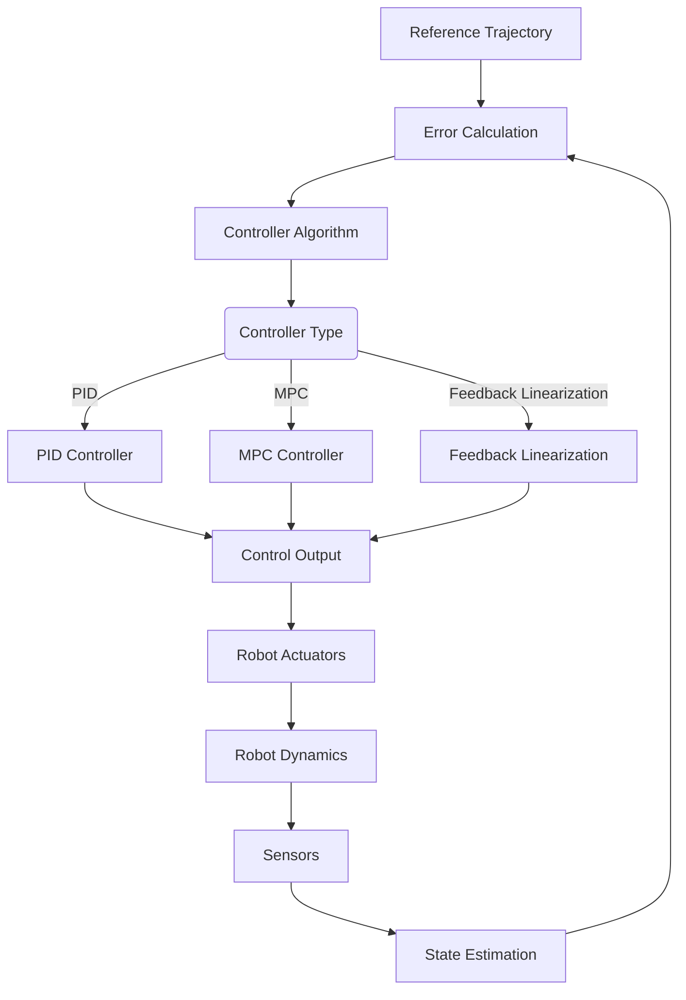

# Control Systems

## Introduction

Control systems are essential for enabling robots to execute desired motions and maintain stability in the presence of disturbances. A control system takes sensor feedback and generates appropriate actuator commands to achieve desired behavior. In robotics, control systems bridge the gap between high-level planning and low-level actuation, ensuring that robots follow planned trajectories accurately and respond appropriately to environmental changes.

## Control System Fundamentals

### System Representation

A control system can be represented in state-space form:

$$ \dot{\mathbf{x}}(t) = \mathbf{f}(\mathbf{x}(t), \mathbf{u}(t), t) $$
$$ \mathbf{y}(t) = \mathbf{h}(\mathbf{x}(t), \mathbf{u}(t), t) $$

Where:
- $ \mathbf{x}(t) $ is the state vector
- $ \mathbf{u}(t) $ is the control input vector
- $ \mathbf{y}(t) $ is the output vector
- $ \mathbf{f} $ and $ \mathbf{h} $ are system dynamics functions

For linear time-invariant systems:
$$ \dot{\mathbf{x}}(t) = \mathbf{A}\mathbf{x}(t) + \mathbf{B}\mathbf{u}(t) $$
$$ \mathbf{y}(t) = \mathbf{C}\mathbf{x}(t) + \mathbf{D}\mathbf{u}(t) $$

### Feedback Control

Feedback control uses sensor measurements to adjust control actions, providing robustness to disturbances and model uncertainties:

$$ \mathbf{u}(t) = \mathbf{K}(\mathbf{r}(t) - \mathbf{y}(t)) $$

Where $ \mathbf{r}(t) $ is the reference signal and $ \mathbf{K} $ is the controller gain matrix.

## PID Control

Proportional-Integral-Derivative (PID) control is one of the most widely used control strategies in robotics due to its simplicity and effectiveness.

### Mathematical Foundation

The PID controller computes the control signal as:

$$ u(t) = K_p e(t) + K_i \int_0^t e(\tau) d\tau + K_d \frac{de(t)}{dt} $$

Where:
- $ e(t) = r(t) - y(t) $ is the error signal
- $ K_p $ is the proportional gain
- $ K_i $ is the integral gain
- $ K_d $ is the derivative gain

### PID Implementation

```python
import numpy as np
import matplotlib.pyplot as plt

class PIDController:
    def __init__(self, kp, ki, kd, output_limits=(None, None)):
        """
        Initialize PID controller

        Args:
            kp: Proportional gain
            ki: Integral gain
            kd: Derivative gain
            output_limits: Tuple of (min_output, max_output)
        """
        self.kp = kp
        self.ki = ki
        self.kd = kd
        self.output_limits = output_limits

        self.reset()

    def reset(self):
        """Reset the PID controller"""
        self.last_error = 0.0
        self.integral = 0.0
        self.last_time = None

    def compute(self, error, dt=None):
        """
        Compute PID output

        Args:
            error: Error signal (setpoint - measurement)
            dt: Time step (if None, will be calculated from time)

        Returns:
            Control output
        """
        current_time = time.time()

        if dt is None:
            if self.last_time is None:
                dt = 0.01  # Default time step
            else:
                dt = current_time - self.last_time
            self.last_time = current_time

        # Proportional term
        proportional = self.kp * error

        # Integral term
        self.integral += error * dt
        integral = self.ki * self.integral

        # Derivative term
        if dt > 0:
            derivative = self.kd * (error - self.last_error) / dt
        else:
            derivative = 0
        self.last_error = error

        # Compute total output
        output = proportional + integral + derivative

        # Apply output limits
        if self.output_limits[0] is not None:
            output = max(output, self.output_limits[0])
        if self.output_limits[1] is not None:
            output = min(output, self.output_limits[1])

        return output

# Example: PID control of a simple system
import time

class SimplePlant:
    """Simple first-order system for demonstration"""
    def __init__(self, time_constant=1.0, gain=1.0):
        self.state = 0.0
        self.time_constant = time_constant
        self.gain = gain

    def update(self, input_signal, dt):
        """Update system state with input"""
        # First-order system: dx/dt = (input - state) / time_constant
        dx_dt = (self.gain * input_signal - self.state) / self.time_constant
        self.state += dx_dt * dt
        return self.state

# Simulation parameters
dt = 0.01
time_span = 10.0
steps = int(time_span / dt)

# PID controller with tuned parameters
pid = PIDController(kp=2.0, ki=1.0, kd=0.1, output_limits=(-10, 10))

# Plant to control
plant = SimplePlant(time_constant=1.0, gain=1.0)

# Simulation variables
time_points = []
setpoints = []
measurements = []
controls = []
errors = []

# Initial conditions
current_time = 0.0
setpoint = 1.0  # Step input

for i in range(steps):
    # Get current measurement
    measurement = plant.state

    # Calculate error
    error = setpoint - measurement

    # Compute control signal
    control_signal = pid.compute(error, dt)

    # Apply control to plant
    plant.update(control_signal, dt)

    # Store data
    time_points.append(current_time)
    setpoints.append(setpoint)
    measurements.append(measurement)
    controls.append(control_signal)
    errors.append(error)

    current_time += dt

    # Change setpoint halfway through simulation
    if i == steps // 2:
        setpoint = 2.0

# Plot results
fig, ((ax1, ax2), (ax3, ax4)) = plt.subplots(2, 2, figsize=(15, 10))

ax1.plot(time_points, setpoints, 'g--', label='Setpoint', linewidth=2)
ax1.plot(time_points, measurements, 'b-', label='Measurement', linewidth=2)
ax1.set_title('PID Control Response')
ax1.set_xlabel('Time (s)')
ax1.set_ylabel('Value')
ax1.legend()
ax1.grid(True)

ax2.plot(time_points, controls, 'r-', label='Control Signal', linewidth=2)
ax2.set_title('Control Signal')
ax2.set_xlabel('Time (s)')
ax2.set_ylabel('Control Output')
ax2.grid(True)

ax3.plot(time_points, errors, 'm-', label='Error', linewidth=2)
ax3.set_title('Error Signal')
ax3.set_xlabel('Time (s)')
ax3.set_ylabel('Error')
ax3.grid(True)

ax4.plot(measurements, controls, 'c-', linewidth=2)
ax4.set_title('Phase Portrait')
ax4.set_xlabel('Measurement')
ax4.set_ylabel('Control Signal')
ax4.grid(True)

plt.tight_layout()
plt.show()

print(f"Final error: {errors[-1]:.6f}")
print(f"Steady-state error: {np.mean(errors[-100:]):.6f}")
```

### PID Tuning Methods

#### Ziegler-Nichols Method

The Ziegler-Nichols method is a classical approach for tuning PID controllers:

```python
class ZieglerNicholsTuner:
    """Ziegler-Nichols tuning methods for PID controllers"""

    @staticmethod
    def step_response_method(k_pu, t_u):
        """
        Ziegler-Nichols step response method
        k_pu: Ultimate proportional gain
        t_u: Ultimate period
        """
        params = {
            'P': {'kp': 0.5 * k_pu},
            'PI': {'kp': 0.45 * k_pu, 'ti': t_u / 1.2},
            'PID': {'kp': 0.6 * k_pu, 'ti': t_u / 2.0, 'td': t_u / 8.0}
        }
        # Convert to PID format (ti = 1/ki, td = kd)
        for key, values in params.items():
            if 'ti' in values:
                values['ki'] = values['kp'] / values['ti']
            else:
                values['ki'] = 0.0
            if 'td' in values:
                values['kd'] = values['td'] * values['kp']
            else:
                values['kd'] = 0.0
        return params

    @staticmethod
    def critical_gain_method(k_cu, t_u):
        """
        Ziegler-Nichols critical gain method
        k_cu: Critical gain
        t_u: Critical period
        """
        params = {
            'P': {'kp': 0.5 * k_cu},
            'PI': {'kp': 0.4 * k_cu, 'ti': 0.8 * t_u},
            'PID': {'kp': 0.6 * k_cu, 'ti': 0.5 * t_u, 'td': 0.125 * t_u}
        }
        # Convert to PID format
        for key, values in params.items():
            if 'ti' in values:
                values['ki'] = values['kp'] / values['ti']
            else:
                values['ki'] = 0.0
            if 'td' in values:
                values['kd'] = values['td'] * values['kp']
            else:
                values['kd'] = 0.0
        return params

# Example: Auto-tuning using relay feedback
def relay_feedback_auto_tune(plant, relay_amplitude=1.0, max_iterations=1000):
    """
    Auto-tune PID using relay feedback method
    """
    # Initialize for limit cycle detection
    outputs = []
    states = []
    dt = 0.01

    # Apply relay feedback to induce oscillation
    control_output = relay_amplitude
    plant.state = 0.0

    for i in range(max_iterations):
        # Apply control
        plant.update(control_output, dt)

        # Relay switching based on plant output
        if plant.state > 0:
            control_output = -relay_amplitude
        else:
            control_output = relay_amplitude

        outputs.append(plant.state)
        states.append(plant.state)

        # Check for limit cycle (oscillation)
        if i > 100:  # Wait for initial transient
            # Simple detection: look for consistent oscillation
            recent_output = outputs[-50:]
            if len(recent_output) > 10:
                amplitude = (max(recent_output) - min(recent_output)) / 2
                period = 2 * dt * len(recent_output)  # Rough estimate

                if amplitude > 0.1:  # Ensure significant oscillation
                    k_cu = 4 * relay_amplitude / (np.pi * amplitude)
                    return k_cu, period

    return None, None  # Failed to find oscillation
```

#### Advanced PID Variants

```python
class AdvancedPIDController:
    """Advanced PID implementations"""

    def __init__(self, kp, ki, kd, derivative_filter_coeff=0.1):
        self.kp = kp
        self.ki = ki
        self.kd = kd
        self.filter_coeff = derivative_filter_coeff

        self.reset()

    def reset(self):
        """Reset controller state"""
        self.integral = 0.0
        self.last_error = 0.0
        self.filtered_derivative = 0.0
        self.last_time = None

    def compute_with_derivative_filter(self, error, dt=None):
        """
        PID with derivative filtering to reduce noise sensitivity
        """
        if dt is None:
            current_time = time.time()
            if self.last_time is None:
                dt = 0.01
            else:
                dt = current_time - self.last_time
            self.last_time = current_time

        # Proportional term
        proportional = self.kp * error

        # Integral term
        self.integral += error * dt
        integral = self.ki * self.integral

        # Derivative term with filtering
        if dt > 0:
            raw_derivative = (error - self.last_error) / dt
            # Apply first-order low-pass filter
            self.filtered_derivative = (
                self.filter_coeff * raw_derivative +
                (1 - self.filter_coeff) * self.filtered_derivative
            )
        else:
            self.filtered_derivative = 0
        self.last_error = error

        derivative = self.kd * self.filtered_derivative

        return proportional + integral + derivative

    def compute_with_anti_windup(self, error, dt=None, output_limits=(-10, 10)):
        """
        PID with anti-windup to prevent integral windup
        """
        if dt is None:
            current_time = time.time()
            if self.last_time is None:
                dt = 0.01
            else:
                dt = current_time - self.last_time
            self.last_time = current_time

        # Proportional term
        proportional = self.kp * error

        # Integral term with anti-windup
        integral_input = self.ki * error * dt
        potential_integral = self.integral + integral_input

        # Check if output would saturate
        potential_output = proportional + potential_integral
        if output_limits[0] is not None and potential_output < output_limits[0]:
            # Output would saturate low, limit integral growth
            if integral_input < 0:
                self.integral = potential_integral
        elif output_limits[1] is not None and potential_output > output_limits[1]:
            # Output would saturate high, limit integral growth
            if integral_input > 0:
                self.integral = potential_integral
        else:
            # No saturation, update normally
            self.integral = potential_integral

        integral = self.integral

        # Derivative term
        if dt > 0:
            derivative = self.kd * (error - self.last_error) / dt
        else:
            derivative = 0
        self.last_error = error

        output = proportional + integral + derivative

        # Apply output limits
        if output_limits[0] is not None:
            output = max(output, output_limits[0])
        if output_limits[1] is not None:
            output = min(output, output_limits[1])

        return output
```

## Model Predictive Control (MPC)

Model Predictive Control is an advanced control strategy that uses a model of the system to predict future behavior and optimize control actions over a finite horizon.

### Mathematical Foundation

MPC solves an optimization problem at each time step:

$$ \min_{\mathbf{U}} J = \sum_{k=1}^{N_p} \| \mathbf{x}(t+k|t) - \mathbf{x}_{ref}(t+k) \|_{\mathbf{Q}}^2 + \sum_{k=0}^{N_c-1} \| \mathbf{u}(t+k) \|_{\mathbf{R}}^2 $$

Subject to:
- System dynamics: $ \mathbf{x}(t+1) = \mathbf{f}(\mathbf{x}(t), \mathbf{u}(t)) $
- Constraints: $ \mathbf{u}_{min} \leq \mathbf{u}(t+k) \leq \mathbf{u}_{max} $

Where:
- $ N_p $: Prediction horizon
- $ N_c $: Control horizon
- $ \mathbf{Q}, \mathbf{R} $: Weight matrices

### Linear MPC Implementation

```python
from scipy.optimize import minimize
import numpy as np

class LinearMPC:
    def __init__(self, A, B, Q, R, Np, Nc, umin=None, umax=None, xmin=None, xmax=None):
        """
        Linear Model Predictive Controller

        Args:
            A: State matrix (n x n)
            B: Input matrix (n x m)
            Q: State cost matrix (n x n)
            R: Input cost matrix (m x m)
            Np: Prediction horizon
            Nc: Control horizon
            umin, umax: Input constraints
            xmin, xmax: State constraints
        """
        self.A = np.array(A)
        self.B = np.array(B)
        self.Q = np.array(Q)
        self.R = np.array(R)
        self.Np = Np  # Prediction horizon
        self.Nc = Nc  # Control horizon (usually Nc <= Np)

        # Constraints
        self.umin = umin
        self.umax = umax
        self.xmin = xmin
        self.xmax = xmax

        # System dimensions
        self.n_states = A.shape[0]
        self.n_inputs = B.shape[1]

    def predict_states(self, x0, U):
        """
        Predict states given initial state and control sequence

        Args:
            x0: Initial state (n_states,)
            U: Control sequence (Nc, n_inputs)

        Returns:
            X: Predicted state sequence (Np+1, n_states)
        """
        X = np.zeros((self.Np + 1, self.n_states))
        X[0] = x0

        for k in range(self.Np):
            if k < self.Nc:
                u = U[k]
            else:
                u = np.zeros(self.n_inputs)  # Zero control after Nc

            X[k+1] = self.A @ X[k] + self.B @ u

        return X

    def cost_function(self, U_flat, x0, x_ref):
        """
        Cost function for MPC optimization

        Args:
            U_flat: Flattened control sequence (Nc * n_inputs,)
            x0: Initial state
            x_ref: Reference trajectory (Np+1, n_states)

        Returns:
            Total cost
        """
        # Reshape control sequence
        U = U_flat.reshape((self.Nc, self.n_inputs))

        # Predict states
        X = self.predict_states(x0, U)

        # Calculate cost
        cost = 0.0

        # State cost
        for k in range(self.Np + 1):
            error = X[k] - x_ref[k]
            cost += error.T @ self.Q @ error

        # Control cost
        for k in range(self.Nc):
            cost += U[k].T @ self.R @ U[k]

        return cost

    def solve(self, x0, x_ref):
        """
        Solve MPC optimization problem

        Args:
            x0: Current state (n_states,)
            x_ref: Reference trajectory (Np+1, n_inputs)

        Returns:
            Optimal control sequence (Nc, n_inputs)
        """
        # Initial guess for control sequence
        U0 = np.zeros(self.Nc * self.n_inputs)

        # Define constraints
        constraints = []

        # Bounds for optimization
        bounds = []
        for i in range(self.Nc * self.n_inputs):
            if self.umin is not None:
                lower_bound = self.umin
            else:
                lower_bound = -np.inf

            if self.umax is not None:
                upper_bound = self.umax
            else:
                upper_bound = np.inf

            bounds.append((lower_bound, upper_bound))

        # Solve optimization problem
        result = minimize(
            fun=self.cost_function,
            x0=U0,
            args=(x0, x_ref),
            method='SLSQP',
            bounds=bounds,
            constraints=constraints
        )

        if not result.success:
            print(f"MPC optimization failed: {result.message}")
            return np.zeros((self.Nc, self.n_inputs))

        # Reshape optimal control sequence
        U_opt = result.x.reshape((self.Nc, self.n_inputs))

        return U_opt

# Example: MPC for a simple system
def example_mpc():
    # Simple double integrator system: x_dot = A*x + B*u
    # State: [position, velocity]
    A = np.array([[1, 0.1], [0, 1]])  # Discretized system matrix
    B = np.array([[0.005], [0.1]])    # Discretized input matrix

    # Cost matrices
    Q = np.array([[10, 0], [0, 1]])   # State cost (emphasize position error)
    R = np.array([[0.1]])             # Input cost

    # MPC parameters
    mpc = LinearMPC(A, B, Q, R, Np=20, Nc=5, umin=-5, umax=5)

    # Simulation
    dt = 0.1
    time_steps = 100
    states = np.zeros((time_steps, 2))
    controls = np.zeros((time_steps, 1))
    references = np.zeros((time_steps, 2))

    # Initial conditions
    states[0] = [0, 0]  # Start at origin with zero velocity
    references[:, 0] = 1.0  # Position reference
    references[:, 1] = 0.0  # Velocity reference

    for t in range(time_steps - 1):
        # Create reference trajectory (constant reference for next Np steps)
        x_ref = np.tile(references[t], (mpc.Np + 1, 1))

        # Solve MPC problem
        U_opt = mpc.solve(states[t], x_ref)

        # Apply first control input
        u = U_opt[0, 0]
        controls[t] = u

        # Update system
        states[t+1] = A @ states[t] + B.flatten() * u

    # Plot results
    time = np.arange(time_steps) * dt

    fig, (ax1, ax2, ax3) = plt.subplots(3, 1, figsize=(10, 12))

    ax1.plot(time, states[:, 0], label='Position', linewidth=2)
    ax1.plot(time, references[:, 0], '--', label='Reference', linewidth=2)
    ax1.set_title('MPC Position Tracking')
    ax1.set_ylabel('Position')
    ax1.legend()
    ax1.grid(True)

    ax2.plot(time, states[:, 1], label='Velocity', linewidth=2)
    ax2.plot(time, references[:, 1], '--', label='Reference', linewidth=2)
    ax2.set_title('MPC Velocity Tracking')
    ax2.set_ylabel('Velocity')
    ax2.legend()
    ax2.grid(True)

    ax3.plot(time, controls, label='Control Input', linewidth=2)
    ax3.set_title('MPC Control Input')
    ax3.set_ylabel('Control')
    ax3.set_xlabel('Time (s)')
    ax3.legend()
    ax3.grid(True)

    plt.tight_layout()
    plt.show()

    print(f"Final position: {states[-1, 0]:.3f}, Final velocity: {states[-1, 1]:.3f}")
    print(f"Final error: {references[-1, 0] - states[-1, 0]:.3f}")

# Run example
example_mpc()
```

### Nonlinear MPC

For nonlinear systems, more sophisticated approaches are needed:

```python
class NonlinearMPC:
    def __init__(self, dynamics_func, cost_func, Np, Nc, umin=None, umax=None):
        """
        Nonlinear Model Predictive Controller

        Args:
            dynamics_func: Function f(x, u) that returns dx/dt or x(k+1)
            cost_func: Function that computes stage cost L(x, u)
            Np: Prediction horizon
            Nc: Control horizon
            umin, umax: Input constraints
        """
        self.dynamics_func = dynamics_func
        self.cost_func = cost_func
        self.Np = Np
        self.Nc = Nc
        self.umin = umin
        self.umax = umax

    def predict_trajectory(self, x0, U, dt=0.1):
        """
        Predict trajectory given initial state and control sequence
        """
        X = [x0.copy()]
        x_current = x0.copy()

        for k in range(self.Np):
            if k < self.Nc:
                u = U[k]
            else:
                u = np.zeros_like(U[0])  # Zero control after Nc

            # Integrate dynamics (simple Euler for demonstration)
            dx = self.dynamics_func(x_current, u)
            x_next = x_current + dx * dt

            X.append(x_next)
            x_current = x_next

        return np.array(X)

    def total_cost(self, U_flat, x0, x_ref, terminal_cost_func=None):
        """
        Calculate total cost of trajectory
        """
        # Reshape control sequence
        U = U_flat.reshape((self.Nc, -1))

        # Predict trajectory
        X = self.predict_trajectory(x0, U)

        # Calculate cost
        total_cost = 0.0

        # Stage costs
        for k in range(self.Np):
            if k < len(X) and k < len(x_ref):
                total_cost += self.cost_func(X[k], U[k] if k < len(U) else np.zeros_like(U[0]))

        # Terminal cost
        if terminal_cost_func and len(X) > 0:
            total_cost += terminal_cost_func(X[-1], x_ref[-1] if len(x_ref) > 0 else X[-1])

        return total_cost

    def solve(self, x0, x_ref, dt=0.1):
        """
        Solve nonlinear MPC problem
        """
        # Initial guess
        U0 = np.zeros(self.Nc * len(x0))  # Assuming control dimension equals state dimension

        # Bounds
        n_controls = len(x0)  # Assuming this is the control dimension
        bounds = []
        for i in range(self.Nc * n_controls):
            bounds.append((self.umin, self.umax) if self.umin is not None and self.umax is not None else (-np.inf, np.inf))

        # Solve optimization
        result = minimize(
            fun=self.total_cost,
            x0=U0,
            args=(x0, x_ref),
            method='SLSQP',
            bounds=bounds
        )

        if result.success:
            return result.x.reshape((self.Nc, n_controls))
        else:
            print(f"Nonlinear MPC optimization failed: {result.message}")
            return np.zeros((self.Nc, n_controls))
```

## Feedback Linearization

Feedback linearization is a control technique that transforms a nonlinear system into a linear one through feedback and coordinate transformation.

### Mathematical Foundation

For a nonlinear system:
$$ \dot{\mathbf{x}} = \mathbf{f}(\mathbf{x}) + \mathbf{g}(\mathbf{x})u $$

The goal is to find a control law $ u = \alpha(\mathbf{x}) + \beta(\mathbf{x})v $ such that the closed-loop system becomes linear:
$$ \dot{\mathbf{z}} = \mathbf{A}\mathbf{z} + \mathbf{B}v $$

Where $ \mathbf{z} = \mathbf{T}(\mathbf{x}) $ is a coordinate transformation.

### Example: Feedback Linearization

```python
class FeedbackLinearizationController:
    """
    Feedback linearization controller for a class of nonlinear systems
    """
    def __init__(self, f_func, g_func, linear_controller):
        """
        Initialize feedback linearization controller

        Args:
            f_func: Function representing f(x) in dx/dt = f(x) + g(x)*u
            g_func: Function representing g(x) in dx/dt = f(x) + g(x)*u
            linear_controller: Linear controller for the linearized system
        """
        self.f_func = f_func
        self.g_func = g_func
        self.linear_controller = linear_controller

    def compute(self, x, x_ref, dt=None):
        """
        Compute control input using feedback linearization
        """
        # Compute nonlinear terms
        f_val = self.f_func(x)
        g_val = self.g_func(x)

        # Linearize the system
        # For simple case: z = x, so we want dz/dt = A*z + B*v
        # The linearized system would be: dx/dt = f(x) + g(x)*u
        # We want: dx/dt = v (linear system with input v)
        # So: f(x) + g(x)*u = v
        # Therefore: u = (v - f(x)) / g(x)  (for scalar case)

        # Compute desired linearized input using linear controller
        error = x_ref - x
        v = self.linear_controller.compute(error)

        # Compute nonlinear control input
        if np.isscalar(g_val):
            u = (v - f_val) / g_val
        else:
            # For vector case
            u = np.linalg.solve(g_val, v - f_val)

        return u

# Example: Control of a simple nonlinear system
def example_feedback_linearization():
    """
    Example: Control of a system dx/dt = x^2 + u
    """
    # Define system: dx/dt = f(x) + g(x)*u
    # For dx/dt = x^2 + u: f(x) = x^2, g(x) = 1
    def f_func(x):
        return x**2

    def g_func(x):
        return 1.0

    # Linear controller for the linearized system (simple PD)
    linear_controller = lambda error: 2.0 * error[0] + 1.0 * error[1] if len(error) > 1 else 2.0 * error

    # For this example, we'll use a simple PD controller
    class SimplePD:
        def __init__(self, kp=2.0, kd=1.0):
            self.kp = kp
            self.kd = kd

        def compute(self, error):
            return self.kp * error

    pd_controller = SimplePD()

    # Create feedback linearization controller
    flc = FeedbackLinearizationController(f_func, g_func, pd_controller)

    # Simulation
    dt = 0.01
    time_steps = 1000
    x = np.zeros(time_steps)
    u = np.zeros(time_steps)

    # Initial conditions
    x[0] = 1.0  # Start with x = 1
    x_ref = 0.0  # Control to zero

    for i in range(time_steps - 1):
        # Compute control input
        u[i] = flc.compute(x[i], x_ref)

        # Update system: dx/dt = x^2 + u
        dx_dt = x[i]**2 + u[i]
        x[i+1] = x[i] + dx_dt * dt

    # Plot results
    time = np.arange(time_steps) * dt

    fig, (ax1, ax2) = plt.subplots(2, 1, figsize=(10, 8))

    ax1.plot(time, x, 'b-', linewidth=2, label='State x')
    ax1.axhline(y=x_ref, color='r', linestyle='--', label='Reference')
    ax1.set_title('Feedback Linearization Control')
    ax1.set_ylabel('State x')
    ax1.legend()
    ax1.grid(True)

    ax2.plot(time, u, 'g-', linewidth=2, label='Control u')
    ax2.set_title('Control Input')
    ax2.set_ylabel('Control u')
    ax2.set_xlabel('Time (s)')
    ax2.legend()
    ax2.grid(True)

    plt.tight_layout()
    plt.show()

    print(f"Final state: {x[-1]:.6f}, Final control: {u[-1]:.6f}")
    print(f"Final error: {abs(x_ref - x[-1]):.6f}")

# Run example
example_feedback_linearization()
```

## Trajectory Tracking Controllers

Trajectory tracking controllers ensure that a robot follows a desired time-varying trajectory.

```python
class TrajectoryTracker:
    """
    General trajectory tracking controller
    """
    def __init__(self, kp_pos=1.0, kp_vel=1.0, ki_pos=0.0, dt=0.01):
        self.kp_pos = kp_pos  # Position gain
        self.kp_vel = kp_vel  # Velocity gain
        self.ki_pos = ki_pos  # Position integral gain

        self.dt = dt
        self.pos_integral = 0.0
        self.last_time = None

    def track(self, current_pos, current_vel, desired_pos, desired_vel, desired_acc=0):
        """
        Compute control for trajectory tracking

        Args:
            current_pos: Current position
            current_vel: Current velocity
            desired_pos: Desired position
            desired_vel: Desired velocity
            desired_acc: Desired acceleration

        Returns:
            Control input
        """
        # Position error
        pos_error = desired_pos - current_pos

        # Integrate position error
        self.pos_integral += pos_error * self.dt

        # Velocity error
        vel_error = desired_vel - current_vel

        # Feedforward acceleration
        feedforward = desired_acc

        # Feedback control
        feedback = (self.kp_pos * pos_error +
                   self.kp_vel * vel_error +
                   self.ki_pos * self.pos_integral)

        return feedforward + feedback

# Example: Trajectory tracking with minimum jerk trajectory
def example_trajectory_tracking():
    # Generate reference trajectory
    t, ref_pos, ref_vel, ref_acc = minimum_jerk_trajectory(0, 5, 5.0, num_points=500)

    # Initialize tracker
    tracker = TrajectoryTracker(kp_pos=2.0, kp_vel=1.5, ki_pos=0.1, dt=t[1]-t[0])

    # Simulation
    pos = np.zeros_like(t)
    vel = np.zeros_like(t)
    acc = np.zeros_like(t)
    control = np.zeros_like(t)

    # Initial conditions
    pos[0] = 0.0  # Start slightly offset from reference
    vel[0] = 0.0

    for i in range(1, len(t)):
        # Compute control for tracking
        control[i-1] = tracker.track(
            pos[i-1], vel[i-1],
            ref_pos[i-1], ref_vel[i-1], ref_acc[i-1]
        )

        # Update system (simple double integrator)
        acc[i-1] = control[i-1]  # For this example, acceleration = control
        vel[i] = vel[i-1] + acc[i-1] * (t[i] - t[i-1])
        pos[i] = pos[i-1] + vel[i] * (t[i] - t[i-1])

    # Plot results
    fig, ((ax1, ax2), (ax3, ax4)) = plt.subplots(2, 2, figsize=(15, 10))

    ax1.plot(t, ref_pos, 'r--', label='Reference', linewidth=2)
    ax1.plot(t, pos, 'b-', label='Actual', linewidth=2)
    ax1.set_title('Position Tracking')
    ax1.set_ylabel('Position')
    ax1.legend()
    ax1.grid(True)

    ax2.plot(t, ref_vel, 'r--', label='Reference', linewidth=2)
    ax2.plot(t, vel, 'b-', label='Actual', linewidth=2)
    ax2.set_title('Velocity Tracking')
    ax2.set_ylabel('Velocity')
    ax2.legend()
    ax2.grid(True)

    ax3.plot(t[:-1], control[:-1], 'g-', label='Control', linewidth=2)
    ax3.set_title('Control Signal')
    ax3.set_ylabel('Control')
    ax3.grid(True)

    ax4.plot(t, ref_pos - pos, 'm-', label='Position Error', linewidth=2)
    ax4.set_title('Tracking Error')
    ax4.set_ylabel('Error')
    ax4.set_xlabel('Time (s)')
    ax4.grid(True)

    plt.tight_layout()
    plt.show()

    # Calculate performance metrics
    final_error = abs(ref_pos[-1] - pos[-1])
    rmse = np.sqrt(np.mean((ref_pos - pos)**2))
    max_error = np.max(np.abs(ref_pos - pos))

    print(f"Final position error: {final_error:.6f}")
    print(f"RMSE: {rmse:.6f}")
    print(f"Max error: {max_error:.6f}")

example_trajectory_tracking()
```

## Mobile Robot Controllers

Mobile robots require specialized control strategies for different types of drive systems.

### Differential Drive Controller

```python
class DifferentialDriveController:
    """
    Controller for differential drive robots
    """
    def __init__(self, wheel_base=0.5, max_linear_vel=1.0, max_angular_vel=1.0):
        self.wheel_base = wheel_base
        self.max_linear_vel = max_linear_vel
        self.max_angular_vel = max_angular_vel

        # PID controllers for linear and angular velocities
        self.linear_pid = PIDController(kp=1.0, ki=0.1, kd=0.05)
        self.angular_pid = PIDController(kp=2.0, ki=0.2, kd=0.1)

    def pose_control(self, current_pose, desired_pose, dt=0.01):
        """
        Control robot to reach desired pose (x, y, theta)

        Args:
            current_pose: Current pose [x, y, theta]
            desired_pose: Desired pose [x, y, theta]
            dt: Time step

        Returns:
            Linear and angular velocities [v, omega]
        """
        cx, cy, ctheta = current_pose
        dx, dy, dtheta = desired_pose

        # Calculate position error in robot frame
        dx_local = (dx - cx) * np.cos(ctheta) + (dy - cy) * np.sin(ctheta)
        dy_local = -(dx - cx) * np.sin(ctheta) + (dy - cy) * np.cos(ctheta)

        # Calculate distance and angle to goal
        rho = np.sqrt(dx_local**2 + dy_local**2)
        alpha = np.arctan2(dy_local, dx_local) - ctheta

        # Normalize alpha to [-pi, pi]
        alpha = np.arctan2(np.sin(alpha), np.cos(alpha))

        # Control law (pure pursuit or similar)
        k_rho = 1.0
        k_alpha = 2.0

        v = k_rho * rho
        omega = k_alpha * alpha

        # Limit velocities
        v = np.clip(v, -self.max_linear_vel, self.max_linear_vel)
        omega = np.clip(omega, -self.max_angular_vel, self.max_angular_vel)

        return v, omega

    def convert_to_wheel_velocities(self, linear_vel, angular_vel):
        """
        Convert linear and angular velocities to wheel velocities
        """
        v_left = linear_vel - (self.wheel_base / 2) * angular_vel
        v_right = linear_vel + (self.wheel_base / 2) * angular_vel

        return v_left, v_right

# Example: Differential drive control
def example_differential_drive():
    controller = DifferentialDriveController(wheel_base=0.3, max_linear_vel=0.5, max_angular_vel=1.0)

    # Simulation parameters
    dt = 0.01
    time_steps = 1000

    # Robot state [x, y, theta]
    pose = np.zeros((time_steps, 3))
    pose[0] = [0, 0, 0]  # Start at origin, facing x direction

    # Desired pose
    desired_pose = [2.0, 1.0, np.pi/4]

    # Store velocities
    linear_vels = np.zeros(time_steps-1)
    angular_vels = np.zeros(time_steps-1)

    for i in range(time_steps - 1):
        # Get control commands
        v, omega = controller.pose_control(pose[i], desired_pose, dt)

        # Store velocities
        linear_vels[i] = v
        angular_vels[i] = omega

        # Update robot pose (kinematic model)
        pose[i+1, 0] = pose[i, 0] + v * np.cos(pose[i, 2]) * dt
        pose[i+1, 1] = pose[i, 1] + v * np.sin(pose[i, 2]) * dt
        pose[i+1, 2] = pose[i, 2] + omega * dt

        # Normalize orientation to [-pi, pi]
        pose[i+1, 2] = np.arctan2(np.sin(pose[i+1, 2]), np.cos(pose[i+1, 2]))

    # Plot results
    fig, ((ax1, ax2), (ax3, ax4)) = plt.subplots(2, 2, figsize=(15, 10))

    # Plot robot trajectory
    ax1.plot(pose[:, 0], pose[:, 1], 'b-', linewidth=2, label='Robot Path')
    ax1.plot(desired_pose[0], desired_pose[1], 'ro', markersize=10, label='Goal')
    ax1.plot(pose[0, 0], pose[0, 1], 'go', markersize=10, label='Start')
    ax1.set_title('Differential Drive Trajectory')
    ax1.set_xlabel('X (m)')
    ax1.set_ylabel('Y (m)')
    ax1.legend()
    ax1.grid(True)
    ax1.axis('equal')

    # Plot orientation
    ax2.plot(np.arange(time_steps) * dt, pose[:, 2], 'b-', linewidth=2)
    ax2.set_title('Robot Orientation')
    ax2.set_ylabel('Theta (rad)')
    ax2.set_xlabel('Time (s)')
    ax2.grid(True)

    # Plot velocities
    ax3.plot(np.arange(time_steps-1) * dt, linear_vels, 'r-', linewidth=2, label='Linear Velocity')
    ax3.set_title('Linear Velocity')
    ax3.set_ylabel('v (m/s)')
    ax3.grid(True)

    ax4.plot(np.arange(time_steps-1) * dt, angular_vels, 'g-', linewidth=2, label='Angular Velocity')
    ax4.set_title('Angular Velocity')
    ax4.set_ylabel('omega (rad/s)')
    ax4.set_xlabel('Time (s)')
    ax4.grid(True)

    plt.tight_layout()
    plt.show()

    # Final position error
    final_error_pos = np.sqrt((pose[-1, 0] - desired_pose[0])**2 + (pose[-1, 1] - desired_pose[1])**2)
    final_error_theta = abs(pose[-1, 2] - desired_pose[2])

    print(f"Final position error: {final_error_pos:.6f} m")
    print(f"Final orientation error: {final_error_theta:.6f} rad")
    print(f"Final pose: [{pose[-1, 0]:.3f}, {pose[-1, 1]:.3f}, {pose[-1, 2]:.3f}]")

example_differential_drive()
```

### Holonomic Robot Controller

```python
class HolonomicController:
    """
    Controller for holonomic robots (e.g., omni-wheel platforms)
    """
    def __init__(self, max_vel=1.0, kp=2.0, ki=0.1, kd=0.05):
        self.max_vel = max_vel
        self.kp = kp
        self.ki = ki
        self.kd = kd

    def control(self, current_pos, desired_pos, current_vel=None, dt=0.01):
        """
        Control holonomic robot to reach desired position

        Args:
            current_pos: Current position [x, y]
            desired_pos: Desired position [x, y]
            current_vel: Current velocity [vx, vy] (optional)
            dt: Time step

        Returns:
            Velocity command [vx, vy]
        """
        # Calculate position error
        error = np.array(desired_pos) - np.array(current_pos)

        # Calculate distance to goal
        distance = np.linalg.norm(error)

        if distance < 0.01:  # Very close to goal
            return np.array([0.0, 0.0])

        # Normalize error direction
        direction = error / distance

        # Calculate desired velocity magnitude (proportional to distance)
        vel_mag = min(self.max_vel, self.kp * distance)
        desired_vel = direction * vel_mag

        return desired_vel

# Example: Holonomic robot control
def example_holonomic():
    controller = HolonomicController(max_vel=0.5)

    # Simulation parameters
    dt = 0.01
    time_steps = 1000

    # Robot state [x, y]
    pos = np.zeros((time_steps, 2))
    pos[0] = [0, 0]  # Start at origin

    # Desired position
    desired_pos = [2.0, 1.5]

    # Store velocities
    vel = np.zeros((time_steps-1, 2))

    for i in range(time_steps - 1):
        # Get control command
        vel[i] = controller.control(pos[i], desired_pos, dt=dt)

        # Update robot position
        pos[i+1] = pos[i] + vel[i] * dt

    # Plot results
    fig, (ax1, ax2) = plt.subplots(1, 2, figsize=(15, 5))

    # Plot robot trajectory
    ax1.plot(pos[:, 0], pos[:, 1], 'b-', linewidth=2, label='Robot Path')
    ax1.plot(desired_pos[0], desired_pos[1], 'ro', markersize=10, label='Goal')
    ax1.plot(pos[0, 0], pos[0, 1], 'go', markersize=10, label='Start')
    ax1.set_title('Holonomic Robot Trajectory')
    ax1.set_xlabel('X (m)')
    ax1.set_ylabel('Y (m)')
    ax1.legend()
    ax1.grid(True)
    ax1.axis('equal')

    # Plot velocity magnitude
    vel_mag = np.linalg.norm(vel, axis=1)
    ax2.plot(np.arange(time_steps-1) * dt, vel_mag, 'r-', linewidth=2)
    ax2.set_title('Velocity Magnitude')
    ax2.set_ylabel('Speed (m/s)')
    ax2.set_xlabel('Time (s)')
    ax2.grid(True)

    plt.tight_layout()
    plt.show()

    # Final position error
    final_error = np.linalg.norm(pos[-1] - desired_pos)
    print(f"Final position error: {final_error:.6f} m")
    print(f"Final position: [{pos[-1, 0]:.3f}, {pos[-1, 1]:.3f}]")

example_holonomic()
```

## Control Loop Diagram



## Summary

Control systems form the backbone of robotic motion execution, enabling robots to follow planned trajectories accurately and respond to disturbances. Key control strategies include:

- **PID Control**: Simple yet effective for many robotic applications, with various tuning methods and advanced variants to handle specific challenges
- **Model Predictive Control (MPC)**: Powerful for handling constraints and optimizing performance over prediction horizons, suitable for complex robotic systems
- **Feedback Linearization**: Advanced technique for controlling nonlinear robotic systems by transforming them into linear ones
- **Specialized Mobile Robot Controllers**: Tailored approaches for different robot types (differential drive, holonomic, etc.)

The choice of control strategy depends on the specific requirements of the robotic application, including the need for optimality, constraint handling, system complexity, and computational resources. Modern robotic systems often combine multiple control approaches to achieve optimal performance across different operational modes.