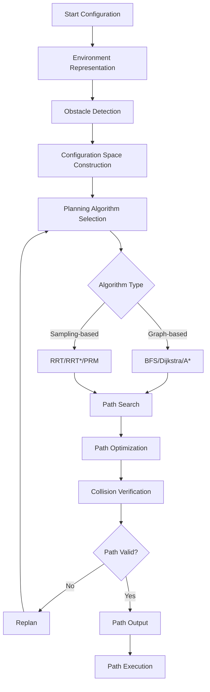

# Motion Planning Algorithms

## Introduction

Motion planning is the computational problem of finding a valid path from a start configuration to a goal configuration while avoiding obstacles. Motion planning algorithms are essential for autonomous robots, enabling them to navigate complex environments safely and efficiently. These algorithms can be broadly classified into several categories based on their approach to exploring the configuration space.

## Configuration Space (C-space)

Before diving into specific algorithms, it's important to understand the configuration space concept. The configuration space represents all possible configurations of a robot. For a robot with n degrees of freedom, the C-space is an n-dimensional space where each point represents a unique configuration of the robot.

### Obstacles in C-space

Physical obstacles in the workspace get transformed into C-space obstacles. A configuration is collision-free if the robot at that configuration doesn't intersect with any physical obstacles.

```python
import numpy as np
import matplotlib.pyplot as plt

def is_collision_free(robot_config, obstacles, robot_radius=0.1):
    """
    Check if a robot configuration is collision-free

    Args:
        robot_config: (x, y) position of robot
        obstacles: List of obstacle centers [(x1, y1), (x2, y2), ...]
        robot_radius: Radius of robot for collision checking

    Returns:
        bool: True if collision-free, False otherwise
    """
    robot_x, robot_y = robot_config

    for obs_x, obs_y in obstacles:
        distance = np.sqrt((robot_x - obs_x)**2 + (robot_y - obs_y)**2)
        if distance <= robot_radius:
            return False

    return True

# Example usage
obstacles = [(2, 2), (3, 4), (5, 3)]
config = (1, 1)
print(f"Configuration {config} is collision-free: {is_collision_free(config, obstacles)}")
```

## Graph-based Planning Algorithms

Graph-based algorithms discretize the environment into a graph structure and search for paths using graph traversal techniques.

### Breadth-First Search (BFS)

BFS explores all nodes at the current depth before moving to nodes at the next depth level. It guarantees finding the shortest path in terms of number of edges (not necessarily geometric distance).

```python
from collections import deque

def bfs(grid, start, goal):
    """
    Breadth-First Search algorithm for grid-based path planning

    Args:
        grid: 2D array where 0 represents free space, 1 represents obstacle
        start: (row, col) starting position
        goal: (row, col) goal position

    Returns:
        List of (row, col) tuples representing the path, or None if no path exists
    """
    rows, cols = len(grid), len(grid[0])

    # Check if start or goal are obstacles
    if grid[start[0]][start[1]] == 1 or grid[goal[0]][goal[1]] == 1:
        return None

    # Directions: up, down, left, right
    directions = [(-1, 0), (1, 0), (0, -1), (0, 1)]

    queue = deque([start])
    visited = set([start])
    parent = {start: None}

    while queue:
        current = queue.popleft()

        if current == goal:
            # Reconstruct path
            path = []
            while current is not None:
                path.append(current)
                current = parent[current]
            return path[::-1]

        for dr, dc in directions:
            neighbor = (current[0] + dr, current[1] + dc)

            # Check bounds
            if 0 <= neighbor[0] < rows and 0 <= neighbor[1] < cols:
                # Check if not obstacle and not visited
                if grid[neighbor[0]][neighbor[1]] == 0 and neighbor not in visited:
                    queue.append(neighbor)
                    visited.add(neighbor)
                    parent[neighbor] = current

    return None  # No path found

# Example usage
grid = [
    [0, 0, 0, 1, 0],
    [0, 1, 0, 1, 0],
    [0, 1, 0, 0, 0],
    [0, 0, 0, 1, 0],
    [0, 0, 0, 0, 0]
]

start = (0, 0)
goal = (4, 4)
path = bfs(grid, start, goal)

if path:
    print(f"BFS path found: {path}")
else:
    print("No path found")
```

### Dijkstra's Algorithm

Dijkstra's algorithm finds the shortest path in a weighted graph, where edge weights represent distances or costs. It's guaranteed to find the optimal path if one exists.

```python
import heapq

def dijkstra(grid, start, goal):
    """
    Dijkstra's algorithm for grid-based path planning

    Args:
        grid: 2D array where 0 represents free space, 1 represents obstacle
        start: (row, col) starting position
        goal: (row, col) goal position

    Returns:
        List of (row, col) tuples representing the path, or None if no path exists
    """
    rows, cols = len(grid), len(grid[0])

    # Check if start or goal are obstacles
    if grid[start[0]][start[1]] == 1 or grid[goal[0]][goal[1]] == 1:
        return None

    # Directions: up, down, left, right, and diagonals
    directions = [(-1, 0), (1, 0), (0, -1), (0, 1),
                  (-1, -1), (-1, 1), (1, -1), (1, 1)]

    # Diagonal distances
    diagonal_cost = np.sqrt(2)
    straight_cost = 1.0

    # Priority queue: (cost, (row, col))
    pq = [(0, start)]
    visited = set()
    parent = {start: None}
    cost = {start: 0}

    while pq:
        current_cost, current = heapq.heappop(pq)

        if current in visited:
            continue

        visited.add(current)

        if current == goal:
            # Reconstruct path
            path = []
            while current is not None:
                path.append(current)
                current = parent[current]
            return path[::-1]

        for dr, dc in directions:
            neighbor = (current[0] + dr, current[1] + dc)

            # Check bounds
            if 0 <= neighbor[0] < rows and 0 <= neighbor[1] < cols:
                # Check if not obstacle
                if grid[neighbor[0]][neighbor[1]] == 0 and neighbor not in visited:
                    # Calculate movement cost
                    move_cost = diagonal_cost if dr != 0 and dc != 0 else straight_cost
                    new_cost = current_cost + move_cost

                    if neighbor not in cost or new_cost < cost[neighbor]:
                        cost[neighbor] = new_cost
                        parent[neighbor] = current
                        heapq.heappush(pq, (new_cost, neighbor))

    return None  # No path found

# Example usage
path_dijkstra = dijkstra(grid, start, goal)
if path_dijkstra:
    print(f"Dijkstra path found with cost: {len(path_dijkstra)-1}")
    print(f"Path: {path_dijkstra}")
else:
    print("No path found")
```

### A* Algorithm

A* is an extension of Dijkstra's algorithm that uses a heuristic function to guide the search toward the goal, making it more efficient. The algorithm uses the formula f(n) = g(n) + h(n), where g(n) is the actual cost from start to node n, and h(n) is the heuristic estimate of the cost from node n to the goal.

```python
def heuristic(pos1, pos2):
    """
    Heuristic function for A* algorithm (Euclidean distance)
    """
    return np.sqrt((pos1[0] - pos2[0])**2 + (pos1[1] - pos2[1])**2)

def astar(grid, start, goal):
    """
    A* algorithm for grid-based path planning

    Args:
        grid: 2D array where 0 represents free space, 1 represents obstacle
        start: (row, col) starting position
        goal: (row, col) goal position

    Returns:
        List of (row, col) tuples representing the path, or None if no path exists
    """
    rows, cols = len(grid), len(grid[0])

    # Check if start or goal are obstacles
    if grid[start[0]][start[1]] == 1 or grid[goal[0]][goal[1]] == 1:
        return None

    # Directions: up, down, left, right, and diagonals
    directions = [(-1, 0), (1, 0), (0, -1), (0, 1),
                  (-1, -1), (-1, 1), (1, -1), (1, 1)]

    # Diagonal distances
    diagonal_cost = np.sqrt(2)
    straight_cost = 1.0

    # Priority queue: (f_score, g_score, (row, col))
    pq = [(heuristic(start, goal), 0, start)]
    visited = set()
    parent = {start: None}
    g_score = {start: 0}

    while pq:
        f_score, current_g, current = heapq.heappop(pq)

        if current in visited:
            continue

        visited.add(current)

        if current == goal:
            # Reconstruct path
            path = []
            while current is not None:
                path.append(current)
                current = parent[current]
            return path[::-1]

        for dr, dc in directions:
            neighbor = (current[0] + dr, current[1] + dc)

            # Check bounds
            if 0 <= neighbor[0] < rows and 0 <= neighbor[1] < cols:
                # Check if not obstacle
                if grid[neighbor[0]][neighbor[1]] == 0 and neighbor not in visited:
                    # Calculate movement cost
                    move_cost = diagonal_cost if dr != 0 and dc != 0 else straight_cost
                    tentative_g = current_g + move_cost
                    h_score = heuristic(neighbor, goal)
                    f_score = tentative_g + h_score

                    if neighbor not in g_score or tentative_g < g_score[neighbor]:
                        g_score[neighbor] = tentative_g
                        parent[neighbor] = current
                        heapq.heappush(pq, (f_score, tentative_g, neighbor))

    return None  # No path found

# Example usage
path_astar = astar(grid, start, goal)
if path_astar:
    print(f"A* path found with cost: {len(path_astar)-1}")
    print(f"Path: {path_astar}")
else:
    print("No path found")
```

## Sampling-based Planning Algorithms

Sampling-based algorithms are particularly useful for high-dimensional configuration spaces where grid-based methods become computationally infeasible. These algorithms build a graph by randomly sampling the configuration space.

### Rapidly-exploring Random Tree (RRT)

RRT is a probabilistically complete algorithm that builds a tree of feasible paths by randomly sampling the configuration space and growing the tree toward these samples.

```python
import numpy as np
import random

class RRT:
    def __init__(self, start, goal, bounds, obstacle_list, step_size=0.5):
        """
        Initialize RRT planner

        Args:
            start: Starting configuration (x, y)
            goal: Goal configuration (x, y)
            bounds: Environment bounds [(min_x, max_x), (min_y, max_y)]
            obstacle_list: List of obstacles [(center_x, center_y, radius), ...]
            step_size: Maximum step size for tree growth
        """
        self.start = start
        self.goal = goal
        self.bounds = bounds
        self.obstacles = obstacle_list
        self.step_size = step_size

        # Tree structure: {node: parent}
        self.tree = {start: None}
        self.nodes = [start]

    def is_collision_free(self, config):
        """Check if configuration is collision-free"""
        x, y = config
        min_x, max_x = self.bounds[0]
        min_y, max_y = self.bounds[1]

        # Check bounds
        if not (min_x <= x <= max_x and min_y <= y <= max_y):
            return False

        # Check obstacles
        for obs_x, obs_y, radius in self.obstacles:
            distance = np.sqrt((x - obs_x)**2 + (y - obs_y)**2)
            if distance <= radius:
                return False

        return True

    def distance(self, config1, config2):
        """Calculate Euclidean distance between two configurations"""
        return np.sqrt((config1[0] - config2[0])**2 + (config1[1] - config2[1])**2)

    def nearest_node(self, config):
        """Find the nearest node in the tree to the given configuration"""
        nearest = self.nodes[0]
        min_dist = self.distance(config, nearest)

        for node in self.nodes[1:]:
            dist = self.distance(config, node)
            if dist < min_dist:
                min_dist = dist
                nearest = node

        return nearest

    def steer(self, from_node, to_node):
        """Generate a new node in the direction from from_node to to_node"""
        dist = self.distance(from_node, to_node)

        if dist <= self.step_size:
            return to_node

        # Calculate direction vector
        direction = ((to_node[0] - from_node[0]) / dist,
                     (to_node[1] - from_node[1]) / dist)

        # Step in that direction
        new_x = from_node[0] + self.step_size * direction[0]
        new_y = from_node[1] + self.step_size * direction[1]

        return (new_x, new_y)

    def plan(self, max_iterations=1000):
        """
        Plan a path using RRT algorithm

        Returns:
            Path as a list of configurations, or None if no path found
        """
        for i in range(max_iterations):
            # Sample random configuration
            rand_x = random.uniform(self.bounds[0][0], self.bounds[0][1])
            rand_y = random.uniform(self.bounds[1][0], self.bounds[1][1])
            rand_config = (rand_x, rand_y)

            # Find nearest node in tree
            nearest = self.nearest_node(rand_config)

            # Steer toward random configuration
            new_config = self.steer(nearest, rand_config)

            # Check if new configuration is collision-free
            if self.is_collision_free(new_config):
                # Add to tree
                self.tree[new_config] = nearest
                self.nodes.append(new_config)

                # Check if goal is reached (within tolerance)
                if self.distance(new_config, self.goal) <= self.step_size:
                    # Add goal to tree
                    self.tree[self.goal] = new_config
                    self.nodes.append(self.goal)

                    # Reconstruct path
                    path = []
                    current = self.goal
                    while current is not None:
                        path.append(current)
                        current = self.tree[current]

                    return path[::-1]

        return None  # No path found

# Example usage
start = (0, 0)
goal = (10, 10)
bounds = [(0, 12), (0, 12)]
obstacles = [(3, 3, 1), (6, 6, 1), (8, 4, 1.5)]

rrt = RRT(start, goal, bounds, obstacles, step_size=0.5)
path = rrt.plan(max_iterations=2000)

if path:
    print(f"RRT path found with {len(path)} nodes")
    print(f"Path: {path[:5]}...")  # Show first 5 nodes
else:
    print("No path found")
```

### RRT*

RRT* is an extension of RRT that provides asymptotic optimality, meaning that as the number of samples approaches infinity, the solution converges to the optimal path.

```python
import math

class RRTStar(RRT):
    def __init__(self, start, goal, bounds, obstacle_list, step_size=0.5, radius=1.5):
        super().__init__(start, goal, bounds, obstacle_list, step_size)
        self.radius = radius  # Radius for finding neighbors

    def near_nodes(self, config):
        """Find all nodes within a certain radius of the configuration"""
        near = []
        for node in self.nodes:
            if self.distance(config, node) <= self.radius:
                near.append(node)
        return near

    def choose_parent(self, new_config, near_nodes):
        """Choose the best parent for the new configuration"""
        min_cost = float('inf')
        best_parent = None

        for node in near_nodes:
            # Calculate cost through this parent
            parent_cost = self.calculate_cost(node)
            edge_cost = self.distance(node, new_config)
            total_cost = parent_cost + edge_cost

            # Check if path is collision-free
            if self.is_collision_free_path(node, new_config) and total_cost < min_cost:
                min_cost = total_cost
                best_parent = node

        return best_parent, min_cost

    def calculate_cost(self, node):
        """Calculate the cost from start to the given node"""
        cost = 0
        current = node
        parent = self.tree[current]

        while parent is not None:
            cost += self.distance(current, parent)
            current = parent
            parent = self.tree[current]

        return cost

    def is_collision_free_path(self, config1, config2):
        """Check if path between two configurations is collision-free"""
        # Use line sampling to check for collisions along the path
        steps = int(self.distance(config1, config2) / 0.1)  # 0.1m resolution
        for i in range(steps + 1):
            t = i / steps
            x = config1[0] + t * (config2[0] - config1[0])
            y = config1[1] + t * (config2[1] - config1[1])

            if not self.is_collision_free((x, y)):
                return False

        return True

    def rewire(self, new_config, near_nodes):
        """Rewire the tree to improve path quality"""
        for node in near_nodes:
            if node == new_config:
                continue

            # Calculate cost through new_config
            new_cost = self.calculate_cost(new_config) + self.distance(new_config, node)
            current_cost = self.calculate_cost(node)

            # Check if rewiring improves the path and is collision-free
            if (new_cost < current_cost and
                self.is_collision_free_path(new_config, node)):
                self.tree[node] = new_config

    def plan(self, max_iterations=2000):
        """
        Plan a path using RRT* algorithm

        Returns:
            Path as a list of configurations, or None if no path found
        """
        for i in range(max_iterations):
            # Sample random configuration
            rand_x = random.uniform(self.bounds[0][0], self.bounds[0][1])
            rand_y = random.uniform(self.bounds[1][0], self.bounds[1][1])
            rand_config = (rand_x, rand_y)

            # Find nearest node in tree
            nearest = self.nearest_node(rand_config)

            # Steer toward random configuration
            new_config = self.steer(nearest, rand_config)

            # Check if new configuration is collision-free
            if self.is_collision_free(new_config):
                # Find nearby nodes
                near_nodes = self.near_nodes(new_config)

                # Choose best parent
                best_parent, min_cost = self.choose_parent(new_config, near_nodes)

                if best_parent is not None:
                    # Add to tree with best parent
                    self.tree[new_config] = best_parent
                    self.nodes.append(new_config)

                    # Rewire the tree
                    self.rewire(new_config, near_nodes)

                    # Check if goal is reached (within tolerance)
                    if self.distance(new_config, self.goal) <= self.step_size:
                        # Add goal to tree
                        self.tree[self.goal] = new_config
                        self.nodes.append(self.goal)

                        # Reconstruct path
                        path = []
                        current = self.goal
                        while current is not None:
                            path.append(current)
                            current = self.tree[current]

                        return path[::-1]

        return None  # No path found

# Example usage
rrt_star = RRTStar(start, goal, bounds, obstacles, step_size=0.5, radius=2.0)
path_rrt_star = rrt_star.plan(max_iterations=2000)

if path_rrt_star:
    print(f"RRT* path found with {len(path_rrt_star)} nodes")
    print(f"Path: {path_rrt_star[:5]}...")  # Show first 5 nodes
else:
    print("No path found")
```

### Probabilistic Roadmap (PRM)

PRM is a multi-query path planning algorithm that pre-computes a roadmap of the environment, which can then be used for multiple planning queries.

```python
class PRM:
    def __init__(self, bounds, obstacle_list, num_samples=500, connection_radius=2.0):
        """
        Initialize PRM planner

        Args:
            bounds: Environment bounds [(min_x, max_x), (min_y, max_y)]
            obstacle_list: List of obstacles [(center_x, center_y, radius), ...]
            num_samples: Number of random samples to generate
            connection_radius: Maximum distance for connecting nodes
        """
        self.bounds = bounds
        self.obstacles = obstacle_list
        self.num_samples = num_samples
        self.connection_radius = connection_radius

        # Graph structure: {node: [neighbors]}
        self.graph = {}
        self.nodes = []

    def is_collision_free(self, config):
        """Check if configuration is collision-free"""
        x, y = config
        min_x, max_x = self.bounds[0]
        min_y, max_y = self.bounds[1]

        # Check bounds
        if not (min_x <= x <= max_x and min_y <= y <= max_y):
            return False

        # Check obstacles
        for obs_x, obs_y, radius in self.obstacles:
            distance = np.sqrt((x - obs_x)**2 + (y - obs_y)**2)
            if distance <= radius:
                return False

        return True

    def distance(self, config1, config2):
        """Calculate Euclidean distance between two configurations"""
        return np.sqrt((config1[0] - config2[0])**2 + (config1[1] - config2[1])**2)

    def is_collision_free_path(self, config1, config2):
        """Check if path between two configurations is collision-free"""
        # Use line sampling to check for collisions along the path
        steps = int(self.distance(config1, config2) / 0.1)  # 0.1m resolution
        for i in range(steps + 1):
            t = i / steps
            x = config1[0] + t * (config2[0] - config1[0])
            y = config1[1] + t * (config2[1] - config1[1])

            if not self.is_collision_free((x, y)):
                return False

        return True

    def build_roadmap(self):
        """Build the probabilistic roadmap"""
        # Sample random configurations
        for i in range(self.num_samples):
            # Generate random configuration
            x = random.uniform(self.bounds[0][0], self.bounds[0][1])
            y = random.uniform(self.bounds[1][0], self.bounds[1][1])
            config = (x, y)

            # Check if collision-free
            if self.is_collision_free(config):
                self.nodes.append(config)
                self.graph[config] = []

        # Connect nearby nodes
        for i, node1 in enumerate(self.nodes):
            for j, node2 in enumerate(self.nodes):
                if i != j and self.distance(node1, node2) <= self.connection_radius:
                    if self.is_collision_free_path(node1, node2):
                        self.graph[node1].append(node2)
                        self.graph[node2].append(node1)

    def dijkstra_shortest_path(self, start, goal):
        """Find shortest path using Dijkstra's algorithm on the roadmap"""
        # Find nearest nodes to start and goal
        start_node = min(self.nodes, key=lambda n: self.distance(n, start))
        goal_node = min(self.nodes, key=lambda n: self.distance(n, goal))

        # Add start and goal to graph temporarily
        temp_connections_start = []
        temp_connections_goal = []

        # Connect start to nearby roadmap nodes
        for node in self.nodes:
            if self.distance(start, node) <= self.connection_radius:
                if self.is_collision_free_path(start, node):
                    temp_connections_start.append(node)

        # Connect goal to nearby roadmap nodes
        for node in self.nodes:
            if self.distance(goal, node) <= self.connection_radius:
                if self.is_collision_free_path(node, goal):
                    temp_connections_goal.append(node)

        # Dijkstra's algorithm
        distances = {node: float('inf') for node in self.nodes}
        distances[start_node] = self.distance(start, start_node)  # 0 for actual start
        previous = {node: None for node in self.nodes}

        unvisited = set(self.nodes)

        while unvisited:
            current = min(unvisited, key=lambda node: distances[node])
            unvisited.remove(current)

            if current == goal_node:
                break

            # Get neighbors (including temporary connections)
            neighbors = self.graph[current].copy()

            # Add temporary connections if current is start_node or goal_node
            if current == start_node:
                neighbors.extend(temp_connections_start)
            elif current == goal_node:
                neighbors.extend(temp_connections_goal)

            for neighbor in neighbors:
                if neighbor in unvisited:
                    # Calculate distance
                    if current == start_node and neighbor in temp_connections_start:
                        new_distance = self.distance(start, neighbor)
                    elif neighbor == goal_node and neighbor in temp_connections_goal:
                        new_distance = distances[current] + self.distance(current, goal)
                    else:
                        new_distance = distances[current] + self.distance(current, neighbor)

                    if new_distance < distances[neighbor]:
                        distances[neighbor] = new_distance
                        previous[neighbor] = current

        # Reconstruct path
        path = []
        current = goal_node

        # Add goal to path
        path.append(goal)

        while current != start_node:
            path.append(current)
            current = previous[current]
            if current is None:
                return None  # No path found

        # Add start to path
        path.append(start)
        path.reverse()

        return path

# Example usage
prm = PRM(bounds, obstacles, num_samples=200, connection_radius=2.0)
prm.build_roadmap()
path_prm = prm.dijkstra_shortest_path(start, goal)

if path_prm:
    print(f"PRM path found with {len(path_prm)} nodes")
    print(f"Path: {path_prm[:5]}...")  # Show first 5 nodes
else:
    print("No path found")
```

## Collision Checking

Collision checking is a critical component of motion planning algorithms. It determines whether a robot configuration or path segment intersects with obstacles.

```python
def check_path_collision(path, obstacles, robot_radius=0.1):
    """
    Check if a path is collision-free

    Args:
        path: List of configurations [(x1, y1), (x2, y2), ...]
        obstacles: List of obstacles [(center_x, center_y, radius), ...]
        robot_radius: Radius of robot for collision checking

    Returns:
        bool: True if path is collision-free, False otherwise
    """
    for config in path:
        if not is_collision_free(config, obstacles, robot_radius):
            return False

    # Also check segments between consecutive configurations
    for i in range(len(path) - 1):
        if not is_path_segment_collision_free(path[i], path[i+1], obstacles, robot_radius):
            return False

    return True

def is_path_segment_collision_free(start, end, obstacles, robot_radius=0.1):
    """
    Check if a straight-line segment between two configurations is collision-free
    """
    # Sample points along the segment
    steps = int(distance(start, end) / 0.05)  # 5cm resolution
    for i in range(steps + 1):
        t = i / steps
        x = start[0] + t * (end[0] - start[0])
        y = start[1] + t * (end[1] - start[1])

        if not is_collision_free((x, y), obstacles, robot_radius):
            return False

    return True

def distance(point1, point2):
    """Calculate Euclidean distance between two points"""
    return np.sqrt((point1[0] - point2[0])**2 + (point1[1] - point2[1])**2)

def is_collision_free(config, obstacles, robot_radius=0.1):
    """Check if a configuration is collision-free"""
    x, y = config

    for obs_x, obs_y, obs_radius in obstacles:
        distance_to_obstacle = np.sqrt((x - obs_x)**2 + (y - obs_y)**2)
        if distance_to_obstacle <= robot_radius + obs_radius:
            return False

    return True
```

## Planning Pipeline Diagram



## Algorithm Comparison

| Algorithm | Completeness | Optimality | Complexity | Best Use Case |
|-----------|--------------|------------|------------|---------------|
| BFS | Complete | Not optimal | O(b^d) | Unweighted grids |
| Dijkstra | Complete | Optimal | O(E + V log V) | Weighted graphs |
| A* | Complete* | Optimal* | O(b^d) | Pathfinding with good heuristic |
| RRT | Probabilistically complete | No | O(n) per iteration | High-dimensional spaces |
| RRT* | Probabilistically complete | Asymptotically optimal | O(n) per iteration | High-dimensional spaces, optimal paths |
| PRM | Probabilistically complete | Optimal* | O(n²) preprocessing | Multi-query scenarios |

*Completeness/optimality depends on the heuristic function being admissible (never overestimating the true cost).

## Summary

Motion planning algorithms provide the foundation for autonomous robot navigation. Graph-based algorithms like BFS, Dijkstra, and A* work well for discretized environments, while sampling-based algorithms like RRT, RRT*, and PRM excel in high-dimensional continuous spaces. The choice of algorithm depends on the specific requirements of the application, including the need for optimality, computational efficiency, and the dimensionality of the configuration space.