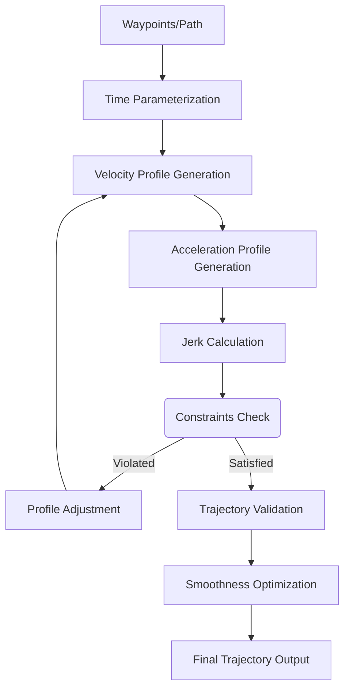

# Trajectory Generation

## Introduction

Trajectory generation is the process of creating time-parameterized paths that specify not only where a robot should go, but also when it should be at each point along the path. A trajectory includes position, velocity, and acceleration profiles over time, ensuring smooth and feasible motion that respects the robot's dynamic constraints.

Unlike simple path planning, which only determines geometric routes, trajectory generation considers temporal aspects and dynamic constraints to produce realistic motion profiles that can be executed by the robot's control system.

## Trajectory Representation

A trajectory can be represented as a function of time:

$$ \mathbf{q}(t) = [q_1(t), q_2(t), ..., q_n(t)]^T $$

Where $ \mathbf{q}(t) $ is the vector of joint positions at time $ t $, and $ n $ is the number of degrees of freedom.

From the position trajectory, we can derive:
- Velocity: $ \dot{\mathbf{q}}(t) = \frac{d}{dt}\mathbf{q}(t) $
- Acceleration: $ \ddot{\mathbf{q}}(t) = \frac{d^2}{dt^2}\mathbf{q}(t) $
- Jerk: $ \dddot{\mathbf{q}}(t) = \frac{d^3}{dt^3}\mathbf{q}(t) $

## Minimum-Jerk Trajectories

Minimum-jerk trajectories are designed to minimize the third derivative of position (jerk), resulting in smooth motion that is comfortable for both robots and humans. The jerk is defined as the rate of change of acceleration.

### Mathematical Foundation

For a point-to-point movement from $ q_0 $ to $ q_f $ over time $ T $, the minimum-jerk trajectory is given by a 5th-order polynomial:

$$ q(t) = a_0 + a_1t + a_2t^2 + a_3t^3 + a_4t^4 + a_5t^5 $$

Subject to the boundary conditions:
- $ q(0) = q_0 $, $ \dot{q}(0) = 0 $, $ \ddot{q}(0) = 0 $
- $ q(T) = q_f $, $ \dot{q}(T) = 0 $, $ \ddot{q}(T) = 0 $

### Implementation

```python
import numpy as np
import matplotlib.pyplot as plt

def minimum_jerk_trajectory(q0, qf, duration, num_points=100):
    """
    Generate minimum-jerk trajectory

    Args:
        q0: Initial position
        qf: Final position
        duration: Total movement duration
        num_points: Number of points in the trajectory

    Returns:
        time, position, velocity, acceleration arrays
    """
    t = np.linspace(0, duration, num_points)

    # Calculate polynomial coefficients
    a0 = q0
    a1 = 0
    a2 = 0
    a3 = 10 * (qf - q0) / duration**3
    a4 = -15 * (qf - q0) / duration**4
    a5 = 6 * (qf - q0) / duration**5

    # Evaluate trajectory
    position = a0 + a1*t + a2*t**2 + a3*t**3 + a4*t**4 + a5*t**5
    velocity = a1 + 2*a2*t + 3*a3*t**2 + 4*a4*t**3 + 5*a5*t**4
    acceleration = 2*a2 + 6*a3*t + 12*a4*t**2 + 20*a5*t**3

    return t, position, velocity, acceleration

# Example usage
t, pos, vel, acc = minimum_jerk_trajectory(0, 10, 5.0)

# Plot results
fig, (ax1, ax2, ax3) = plt.subplots(3, 1, figsize=(10, 10))

ax1.plot(t, pos)
ax1.set_title('Minimum-Jerk Trajectory - Position')
ax1.set_ylabel('Position')

ax2.plot(t, vel)
ax2.set_title('Minimum-Jerk Trajectory - Velocity')
ax2.set_ylabel('Velocity')

ax3.plot(t, acc)
ax3.set_title('Minimum-Jerk Trajectory - Acceleration')
ax3.set_ylabel('Acceleration')
ax3.set_xlabel('Time (s)')

plt.tight_layout()
plt.show()

print(f"Initial position: {pos[0]:.3f}, Final position: {pos[-1]:.3f}")
print(f"Initial velocity: {vel[0]:.3f}, Final velocity: {vel[-1]:.3f}")
print(f"Initial acceleration: {acc[0]:.3f}, Final acceleration: {acc[-1]:.3f}")
```

### Multi-Degree of Freedom Trajectories

For robots with multiple joints, each joint can follow its own minimum-jerk trajectory:

```python
def multi_dof_minimum_jerk_trajectory(q0, qf, duration, num_points=100):
    """
    Generate minimum-jerk trajectory for multiple degrees of freedom

    Args:
        q0: Initial joint positions (array)
        qf: Final joint positions (array)
        duration: Total movement duration
        num_points: Number of points in the trajectory

    Returns:
        time, position, velocity, acceleration arrays
    """
    q0 = np.array(q0)
    qf = np.array(qf)

    # Number of joints
    n_joints = len(q0)

    # Time vector
    t = np.linspace(0, duration, num_points)

    # Initialize output arrays
    positions = np.zeros((num_points, n_joints))
    velocities = np.zeros((num_points, n_joints))
    accelerations = np.zeros((num_points, n_joints))

    # Generate trajectory for each joint
    for i in range(n_joints):
        joint_t, joint_pos, joint_vel, joint_acc = minimum_jerk_trajectory(
            q0[i], qf[i], duration, num_points)
        positions[:, i] = joint_pos
        velocities[:, i] = joint_vel
        accelerations[:, i] = joint_acc

    return t, positions, velocities, accelerations

# Example: 3-DOF robot arm movement
q0 = [0, 0, 0]  # Initial joint angles
qf = [np.pi/2, -np.pi/4, np.pi/3]  # Final joint angles
t, pos, vel, acc = multi_dof_minimum_jerk_trajectory(q0, qf, 3.0)

print(f"Initial joint positions: {pos[0]}")
print(f"Final joint positions: {pos[-1]}")
print(f"Trajectory shape: {pos.shape}")
```

## Bezier Trajectories

Bezier curves provide a flexible way to define smooth trajectories using control points. They are particularly useful for creating complex paths with guaranteed continuity properties.

### Mathematical Foundation

A cubic Bezier curve is defined by four control points $ P_0, P_1, P_2, P_3 $:

$$ B(t) = (1-t)^3P_0 + 3(1-t)^2tP_1 + 3(1-t)t^2P_2 + t^3P_3 $$

Where $ t \in [0, 1] $.

### Implementation

```python
def bezier_trajectory(control_points, num_points=100):
    """
    Generate trajectory using cubic Bezier curve

    Args:
        control_points: List of 4 control points [(x0,y0), (x1,y1), (x2,y2), (x3,y3)]
        num_points: Number of points in the trajectory

    Returns:
        time, x, y arrays
    """
    control_points = np.array(control_points)

    t = np.linspace(0, 1, num_points)

    # Calculate Bezier curve points
    trajectory = np.zeros((num_points, 2))

    for i in range(num_points):
        t_val = t[i]
        # Cubic Bezier formula
        trajectory[i] = (
            (1-t_val)**3 * control_points[0] +
            3*(1-t_val)**2 * t_val * control_points[1] +
            3*(1-t_val) * t_val**2 * control_points[2] +
            t_val**3 * control_points[3]
        )

    x = trajectory[:, 0]
    y = trajectory[:, 1]

    return t, x, y

# Example usage
control_points = [(0, 0), (1, 3), (4, 3), (5, 0)]
t, x, y = bezier_trajectory(control_points)

# Plot the Bezier curve
plt.figure(figsize=(10, 6))
plt.plot(x, y, 'b-', linewidth=2, label='Bezier Trajectory')
plt.plot([pt[0] for pt in control_points], [pt[1] for pt in control_points],
         'ro--', linewidth=1, label='Control Points')
plt.scatter([pt[0] for pt in control_points], [pt[1] for pt in control_points],
            color='red', s=100, zorder=5)
plt.title('Cubic Bezier Trajectory')
plt.xlabel('X')
plt.ylabel('Y')
plt.legend()
plt.grid(True)
plt.axis('equal')
plt.show()

print(f"Start point: ({x[0]:.3f}, {y[0]:.3f})")
print(f"End point: ({x[-1]:.3f}, {y[-1]:.3f})")
```

### Bezier Trajectory with Time Parameterization

To create a time-parameterized trajectory from a Bezier curve:

```python
def bezier_trajectory_with_timing(control_points, duration, num_points=100):
    """
    Generate time-parameterized trajectory using Bezier curve

    Args:
        control_points: List of 4 control points
        duration: Total movement duration
        num_points: Number of points in the trajectory

    Returns:
        time, x, y arrays
    """
    t_norm, x, y = bezier_trajectory(control_points, num_points)
    time = np.linspace(0, duration, num_points)

    return time, x, y

# Example with timing
time, x, y = bezier_trajectory_with_timing(control_points, 4.0)

# Calculate velocity and acceleration by numerical differentiation
dt = time[1] - time[0]
vx = np.gradient(x, dt)
vy = np.gradient(y, dt)
v = np.sqrt(vx**2 + vy**2)  # Speed

ax = np.gradient(vx, dt)
ay = np.gradient(vy, dt)
a = np.sqrt(ax**2 + ay**2)  # Acceleration magnitude

# Plot trajectory with velocity profile
fig, (ax1, ax2) = plt.subplots(2, 1, figsize=(10, 8))

ax1.plot(x, y, 'b-', linewidth=2)
ax1.set_title('Bezier Trajectory with Velocity Profile')
ax1.set_xlabel('X')
ax1.set_ylabel('Y')
ax1.grid(True)

ax2.plot(time, v, 'g-', linewidth=2)
ax2.set_title('Speed Profile')
ax2.set_xlabel('Time (s)')
ax2.set_ylabel('Speed')
ax2.grid(True)

plt.tight_layout()
plt.show()
```

## Spline Trajectories

Spline trajectories use piecewise polynomial functions to create smooth paths through specified waypoints. Cubic splines are commonly used due to their balance of smoothness and computational efficiency.

### Cubic Spline Implementation

```python
from scipy.interpolate import CubicSpline

def cubic_spline_trajectory(waypoints, duration, num_points=100):
    """
    Generate trajectory using cubic spline interpolation

    Args:
        waypoints: List of waypoints [(x1,y1), (x2,y2), ...]
        duration: Total movement duration
        num_points: Number of points in the trajectory

    Returns:
        time, x, y, velocity, acceleration arrays
    """
    waypoints = np.array(waypoints)
    x_waypoints = waypoints[:, 0]
    y_waypoints = waypoints[:, 1]

    # Parameterize the path by cumulative distance
    distances = np.sqrt(np.diff(x_waypoints)**2 + np.diff(y_waypoints)**2)
    s = np.concatenate([[0], np.cumsum(distances)])
    s_normalized = s / s[-1]  # Normalize to [0, 1]

    # Create cubic splines
    cs_x = CubicSpline(s_normalized, x_waypoints)
    cs_y = CubicSpline(s_normalized, y_waypoints)

    # Generate trajectory points
    s_points = np.linspace(0, 1, num_points)
    x = cs_x(s_points)
    y = cs_y(s_points)

    # Calculate derivatives for velocity and acceleration
    dx_ds = cs_x(s_points, 1)  # First derivative
    dy_ds = cs_y(s_points, 1)

    d2x_ds2 = cs_x(s_points, 2)  # Second derivative
    d2y_ds2 = cs_y(s_points, 2)

    # Time parameterization - assume constant speed along path
    time = np.linspace(0, duration, num_points)

    # Calculate velocity (assuming constant speed parameterization)
    ds_dt = s[-1] / duration  # Rate of change of path parameter
    vx = dx_ds * ds_dt
    vy = dy_ds * ds_dt

    # Calculate acceleration
    d2s_dt2 = 0  # Assuming constant speed (ds_dt is constant)
    ax = d2x_ds2 * (ds_dt**2) + dx_ds * d2s_dt2
    ay = d2y_ds2 * (ds_dt**2) + dy_ds * d2s_dt2

    return time, x, y, vx, vy, ax, ay

# Example usage
waypoints = [(0, 0), (1, 2), (3, 1), (4, 3), (5, 0)]
time, x, y, vx, vy, ax, ay = cubic_spline_trajectory(waypoints, 5.0)

# Plot results
fig, ((ax1, ax2), (ax3, ax4)) = plt.subplots(2, 2, figsize=(15, 10))

ax1.plot(x, y, 'b-', linewidth=2, label='Spline Trajectory')
ax1.plot([pt[0] for pt in waypoints], [pt[1] for pt in waypoints],
         'ro', markersize=8, label='Waypoints')
ax1.set_title('Cubic Spline Trajectory')
ax1.set_xlabel('X')
ax1.set_ylabel('Y')
ax1.legend()
ax1.grid(True)

ax2.plot(time, x, label='X position', linewidth=2)
ax2.plot(time, y, label='Y position', linewidth=2)
ax2.set_title('Position vs Time')
ax2.set_xlabel('Time (s)')
ax2.set_ylabel('Position')
ax2.legend()
ax2.grid(True)

ax3.plot(time, np.sqrt(vx**2 + vy**2), 'g-', linewidth=2)
ax3.set_title('Speed vs Time')
ax3.set_xlabel('Time (s)')
ax3.set_ylabel('Speed')
ax3.grid(True)

ax4.plot(time, np.sqrt(ax**2 + ay**2), 'r-', linewidth=2)
ax4.set_title('Acceleration Magnitude vs Time')
ax4.set_xlabel('Time (s)')
ax4.set_ylabel('Acceleration')
ax4.grid(True)

plt.tight_layout()
plt.show()
```

## Time-Parameterized Trajectories

Time-parameterized trajectories specify how position, velocity, and acceleration change over time, enabling precise control of robot motion.

### Velocity and Acceleration Constraints

Real robots have physical limitations on their maximum velocity and acceleration:

```python
def trajectory_with_constraints(q0, qf, duration, max_velocity, max_acceleration, num_points=100):
    """
    Generate trajectory respecting velocity and acceleration constraints

    Args:
        q0: Initial position
        qf: Final position
        duration: Total movement duration
        max_velocity: Maximum allowed velocity
        max_acceleration: Maximum allowed acceleration
        num_points: Number of points in the trajectory

    Returns:
        time, position, velocity, acceleration arrays
    """
    # Simple approach: scale a basic trajectory to respect constraints
    t, pos, vel, acc = minimum_jerk_trajectory(q0, qf, duration, num_points)

    # Scale velocity if it exceeds maximum
    max_vel_actual = np.max(np.abs(vel))
    if max_vel_actual > max_velocity:
        vel = vel * (max_velocity / max_vel_actual)
        # Recalculate position by integration
        dt = t[1] - t[0]
        pos = q0 + np.cumsum(vel) * dt

    # Scale acceleration if it exceeds maximum
    max_acc_actual = np.max(np.abs(acc))
    if max_acc_actual > max_acceleration:
        acc = acc * (max_acceleration / max_acc_actual)
        # Recalculate velocity by integration
        dt = t[1] - t[0]
        vel = np.cumsum(acc) * dt
        # Recalculate position by integration
        pos = q0 + np.cumsum(vel) * dt

    return t, pos, vel, acc

# Example with constraints
t, pos, vel, acc = trajectory_with_constraints(0, 10, 3.0, max_velocity=5.0, max_acceleration=10.0)

# Plot results
fig, (ax1, ax2, ax3) = plt.subplots(3, 1, figsize=(10, 10))

ax1.plot(t, pos)
ax1.set_title('Constrained Trajectory - Position')
ax1.set_ylabel('Position')
ax1.grid(True)

ax2.plot(t, vel)
ax2.set_title('Constrained Trajectory - Velocity')
ax2.set_ylabel('Velocity')
ax2.grid(True)

ax3.plot(t, acc)
ax3.set_title('Constrained Trajectory - Acceleration')
ax3.set_ylabel('Acceleration')
ax3.set_xlabel('Time (s)')
ax3.grid(True)

plt.tight_layout()
plt.show()

print(f"Max velocity: {np.max(np.abs(vel)):.3f} (limit: 5.0)")
print(f"Max acceleration: {np.max(np.abs(acc)):.3f} (limit: 10.0)")
```

### Trapezoidal Velocity Profile

A trapezoidal velocity profile is commonly used in robotics for its simplicity and effectiveness:

```python
def trapezoidal_trajectory(q0, qf, v_max, a_max, num_points=100):
    """
    Generate trapezoidal velocity profile trajectory

    Args:
        q0: Initial position
        qf: Final position
        v_max: Maximum velocity
        a_max: Maximum acceleration
        num_points: Number of points in the trajectory

    Returns:
        time, position, velocity arrays
    """
    distance = abs(qf - q0)
    direction = 1 if qf > q0 else -1

    # Calculate acceleration and deceleration times
    t_acc = v_max / a_max
    accel_dist = 0.5 * a_max * t_acc**2

    if 2 * accel_dist > distance:
        # Triangle profile (never reaches max velocity)
        accel_dist = distance / 2
        v_max = np.sqrt(2 * a_max * accel_dist)
        t_acc = v_max / a_max
        t_total = 2 * t_acc
    else:
        # Trapezoidal profile
        const_dist = distance - 2 * accel_dist
        t_const = const_dist / v_max
        t_total = 2 * t_acc + t_const

    # Generate time vector
    t = np.linspace(0, t_total, num_points)

    # Calculate trajectory
    position = np.zeros_like(t)
    velocity = np.zeros_like(t)

    for i, curr_t in enumerate(t):
        if curr_t <= t_acc:
            # Acceleration phase
            velocity[i] = a_max * curr_t
            position[i] = q0 + direction * 0.5 * a_max * curr_t**2
        elif curr_t <= t_acc + (distance - 2*accel_dist) / v_max if 2*accel_dist <= distance else t_acc:
            # Constant velocity phase
            if 2 * accel_dist <= distance:
                velocity[i] = direction * v_max
                position[i] = q0 + direction * (accel_dist + v_max * (curr_t - t_acc))
            else:
                # Triangle profile: deceleration starts after acceleration phase
                dec_t = curr_t - t_acc
                velocity[i] = direction * (v_max - a_max * dec_t)
                position[i] = q0 + direction * (accel_dist + v_max * dec_t - 0.5 * a_max * dec_t**2)
        else:
            # Deceleration phase
            dec_t = curr_t - (t_total - t_acc)
            velocity[i] = direction * (v_max - a_max * dec_t)
            remaining_dist = 0.5 * a_max * dec_t**2
            position[i] = qf - direction * remaining_dist

    return t, position, velocity

# Example usage
t, pos, vel = trapezoidal_trajectory(0, 10, v_max=3.0, a_max=2.0)

# Calculate acceleration from velocity
dt = t[1] - t[0]
acc = np.gradient(vel, dt)

# Plot results
fig, (ax1, ax2, ax3) = plt.subplots(3, 1, figsize=(10, 10))

ax1.plot(t, pos)
ax1.set_title('Trapezoidal Velocity Profile - Position')
ax1.set_ylabel('Position')
ax1.grid(True)

ax2.plot(t, vel)
ax2.set_title('Trapezoidal Velocity Profile - Velocity')
ax2.set_ylabel('Velocity')
ax2.grid(True)

ax3.plot(t, acc)
ax3.set_title('Trapezoidal Velocity Profile - Acceleration')
ax3.set_ylabel('Acceleration')
ax3.set_xlabel('Time (s)')
ax3.grid(True)

plt.tight_layout()
plt.show()

print(f"Total movement time: {t[-1]:.3f} s")
print(f"Peak velocity: {np.max(np.abs(vel)):.3f}")
print(f"Peak acceleration: {np.max(np.abs(acc)):.3f}")
```

## Trajectory Generation Stages Diagram



## Multi-Modal Trajectory Generation

For complex robotic systems, trajectories may need to be generated in multiple spaces simultaneously:

```python
class MultiModalTrajectoryGenerator:
    """
    Generate trajectories for different aspects of robot motion simultaneously
    """
    def __init__(self):
        self.joint_trajectory = None
        self.cartesian_trajectory = None
        self.orientation_trajectory = None

    def generate_joint_space_trajectory(self, q0, qf, duration, trajectory_type='minimum_jerk'):
        """
        Generate trajectory in joint space
        """
        if trajectory_type == 'minimum_jerk':
            return minimum_jerk_trajectory(q0, qf, duration)
        else:
            raise ValueError(f"Unknown trajectory type: {trajectory_type}")

    def generate_cartesian_trajectory(self, pos0, posf, duration, trajectory_type='minimum_jerk'):
        """
        Generate trajectory in Cartesian space
        """
        # For each Cartesian dimension (x, y, z)
        t, x_pos, x_vel, x_acc = minimum_jerk_trajectory(pos0[0], posf[0], duration)
        _, y_pos, y_vel, y_acc = minimum_jerk_trajectory(pos0[1], posf[1], duration)
        _, z_pos, z_vel, z_acc = minimum_jerk_trajectory(pos0[2], posf[2], duration)

        # Combine into 3D trajectory
        pos = np.column_stack([x_pos, y_pos, z_pos])
        vel = np.column_stack([x_vel, y_vel, z_vel])
        acc = np.column_stack([x_acc, y_acc, z_acc])

        return t, pos, vel, acc

    def interpolate_orientation(self, quat0, quatf, duration, num_points=100):
        """
        Interpolate orientation using spherical linear interpolation (SLERP)
        """
        t = np.linspace(0, duration, num_points)

        # Convert to time parameter
        t_norm = np.linspace(0, 1, num_points)

        # Simple linear interpolation of quaternion components
        # In practice, you'd use proper quaternion SLERP
        orientations = np.zeros((num_points, 4))
        for i in range(4):  # For each quaternion component
            orientations[:, i] = quat0[i] + t_norm * (quatf[i] - quat0[i])

        # Normalize quaternions
        for i in range(num_points):
            orientations[i] = orientations[i] / np.linalg.norm(orientations[i])

        return t, orientations

# Example usage
generator = MultiModalTrajectoryGenerator()

# Joint space trajectory
joint_start = [0, 0, 0]
joint_end = [np.pi/4, -np.pi/6, np.pi/3]
t_joint, pos_joint, vel_joint, acc_joint = generator.generate_joint_space_trajectory(
    joint_start, joint_end, 3.0)

# Cartesian trajectory
cart_start = [0.5, 0.0, 0.3]
cart_end = [0.8, 0.4, 0.6]
t_cart, pos_cart, vel_cart, acc_cart = generator.generate_cartesian_trajectory(
    cart_start, cart_end, 3.0)

print(f"Joint trajectory shape: {pos_joint.shape}")
print(f"Cartesian trajectory shape: {pos_cart.shape}")
```

## Summary

Trajectory generation is a critical component of robot motion planning that bridges the gap between geometric paths and executable motion. Different trajectory types serve different purposes:

- **Minimum-jerk trajectories** provide smooth, natural motion that minimizes jerk and is comfortable for both robots and humans
- **Bezier curves** offer flexible path shaping through control points, useful for creating complex geometric paths
- **Spline trajectories** enable smooth interpolation through specified waypoints with guaranteed continuity
- **Time-parameterized trajectories** ensure that motion profiles respect velocity and acceleration constraints

The choice of trajectory generation method depends on the specific requirements of the application, including the need for smoothness, computational efficiency, and constraint satisfaction. Modern robotic systems often combine multiple trajectory generation techniques to achieve optimal performance across different motion tasks.