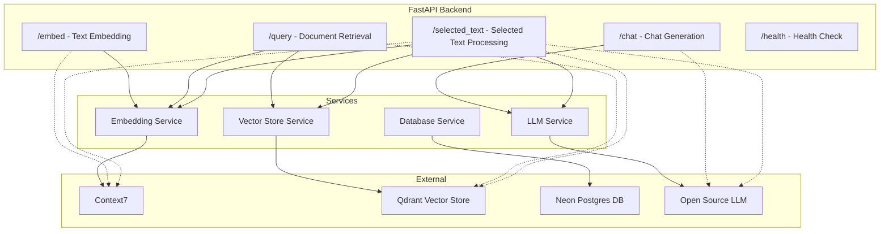

# Backend API Endpoints Diagram

## API Endpoints Description

### `/embed`
- **Method**: POST
- **Purpose**: Generate vector embeddings for text chunks using Context7
- **Input**: Text content and chunk size
- **Output**: Embedding vectors

### `/query`
- **Method**: POST
- **Purpose**: Search for relevant documents in the vector store
- **Input**: Query text and number of results
- **Output**: List of relevant documents with scores

### `/chat`
- **Method**: POST
- **Purpose**: Generate responses using the LLM with context
- **Input**: User message and conversation history
- **Output**: Generated response

### `/selected_text`
- **Method**: POST
- **Purpose**: Process user-selected text with RAG
- **Input**: Selected text and optional context
- **Output**: Response based on selected text

### `/health`
- **Method**: GET
- **Purpose**: Check API health status
- **Output**: Health status information