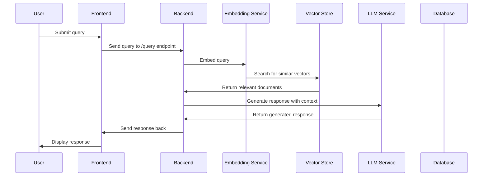
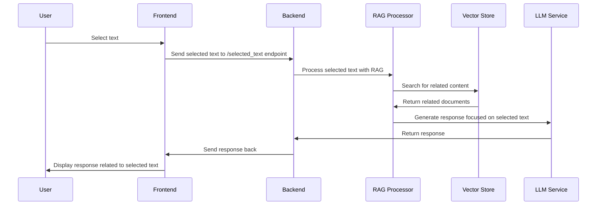

# Detailed Data Flow Diagram

## Standard Query Flow

```mermaid
sequenceDiagram
    participant U as User
    participant F as Frontend
    participant B as Backend
    participant E as Embedding Service
    participant V as Vector Store
    participant L as LLM Service
    participant D as Database

    U->>F: Submit query
    F->>B: Send query to /query endpoint
    B->>E: Embed query
    E->>V: Search for similar vectors
    V->>B: Return relevant documents
    B->>L: Generate response with context
    L->>B: Return generated response
    B->>F: Send response back
    F->>U: Display response
```

## Selected Text Flow

```mermaid
sequenceDiagram
    participant U as User
    participant F as Frontend
    participant B as Backend
    participant R as RAG Processor
    participant V as Vector Store
    participant L as LLM Service

    U->>F: Select text
    F->>B: Send selected text to /selected_text endpoint
    B->>R: Process selected text with RAG
    R->>V: Search for related content
    V->>R: Return related documents
    R->>L: Generate response focused on selected text
    L->>B: Return response
    B->>F: Send response back
    F->>U: Display response related to selected text
```