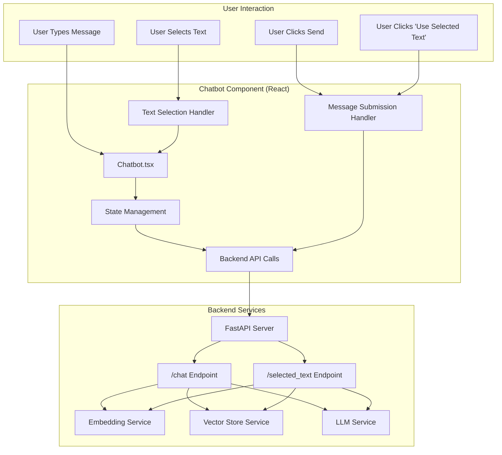

# Frontend Chatbot Widget Interaction Diagram

## Interaction Flow

### Standard Chat Flow
1. **User Types Message**: User enters text in the input field
2. **Message Submission**: User clicks "Send" button
3. **Component State**: Chatbot component updates its state with the new message
4. **API Call**: Component makes POST request to `/chat` endpoint
5. **Backend Processing**: Backend processes the message using embedding, vector store, and LLM services
6. **Response**: Backend returns generated response to frontend
7. **Display**: Component updates state to show the conversation

### Selected Text Flow
1. **Text Selection**: User highlights text on the page
2. **Selection Capture**: JavaScript event listener captures the selected text
3. **UI Notice**: Component displays a notice with the selected text and "Use this text" button
4. **User Action**: User clicks "Use this text" button
5. **API Call**: Component makes POST request to `/selected_text` endpoint with the selected text
6. **Backend Processing**: Backend processes the selected text with RAG
7. **Response**: Backend returns response focused on the selected text
8. **Display**: Component updates state to show the response

## Component Structure

The Chatbot component includes:
- **Message Display Area**: Shows conversation history
- **Input Field**: Where users type messages
- **Send Button**: Submits the message
- **Selected Text Notice**: Appears when text is selected
- **Use Selected Text Button**: Allows using selected text as input
- **Loading Indicator**: Shows when waiting for response