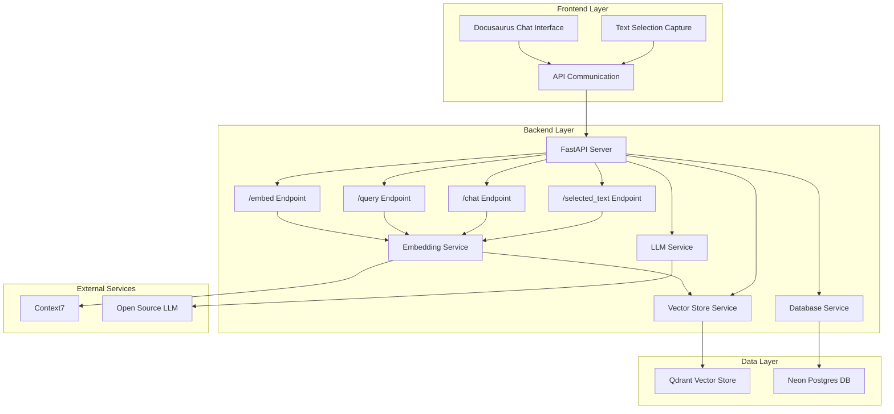

# Overall RAG Chatbot Architecture Diagram

```mermaid
graph TB
    subgraph "Frontend Layer"
        A["Docusaurus Chat Interface"]
        B["Text Selection Capture"]
        C["API Communication"]
    end

    subgraph "Backend Layer"
        D["FastAPI Server"]
        E["/embed Endpoint"]
        F["/query Endpoint"]
        G["/chat Endpoint"]
        H["/selected_text Endpoint"]
        I["Embedding Service"]
        J["LLM Service"]
        K["Vector Store Service"]
        L["Database Service"]
    end

    subgraph "Data Layer"
        M["Qdrant Vector Store"]
        N["Neon Postgres DB"]
    end

    subgraph "External Services"
        O["Context7"]
        P["Open Source LLM"]
    end

    A --> C
    B --> C
    C --> D
    D --> E
    D --> F
    D --> G
    D --> H
    E --> I
    F --> I
    G --> I
    H --> I
    I --> O
    I --> K
    J --> P
    K --> M
    L --> N
    D --> J
    D --> K
    D --> L
```