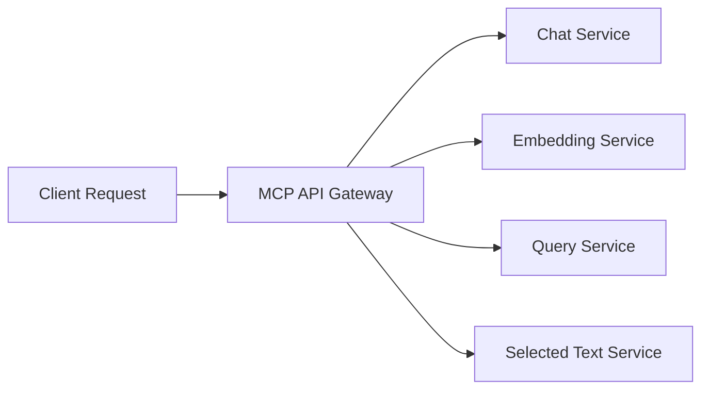

# MCP Server Integration

## Overview

Managed Compute Platform (MCP) servers provide a robust infrastructure for deploying and scaling the RAG Chatbot application. This document explains how to leverage MCP servers and integration patterns for optimal performance and scalability.

## MCP Server Benefits for RAG Chatbot

### Scalability
- **Auto-scaling**: MCP servers can automatically scale based on demand, handling varying loads of chat requests and document processing
- **Load balancing**: Distribute requests across multiple instances to prevent bottlenecks
- **Resource optimization**: Efficient allocation of CPU, memory, and GPU resources based on workload

### Reliability
- **High availability**: Built-in redundancy and failover mechanisms
- **Health monitoring**: Automatic health checks and instance replacement
- **Disaster recovery**: Backup and recovery capabilities for critical data

### Performance
- **Low latency**: Geographically distributed servers for reduced response times
- **Caching**: Built-in caching mechanisms for frequently accessed embeddings and responses
- **Optimized networking**: High-speed internal networking between services

## Integration Patterns

### 1. API Gateway Pattern
Route all incoming requests through an MCP-managed API gateway for:
- Request routing and load distribution
- Authentication and authorization
- Rate limiting and traffic shaping
- SSL termination and security



### 2. Microservices Architecture
Deploy each service as a separate MCP container:
- **Frontend Service**: Docusaurus-based documentation and chat interface
- **Backend API**: FastAPI application handling chat, embed, and query endpoints
- **Embedding Service**: Dedicated service for text embedding operations
- **Vector Store Service**: Interface to Qdrant for similarity search
- **Database Service**: Interface to Neon Postgres for document and chat history storage

### 3. Event-Driven Processing
Use MCP's messaging services for:
- Asynchronous document processing
- Batch embedding operations
- Chat history logging
- Analytics and monitoring

```python
# Example: Using MCP messaging for document processing
async def process_document_async(document_id: str):
    """Publish document processing job to MCP message queue."""
    message = {
        "document_id": document_id,
        "action": "embed_document",
        "timestamp": datetime.utcnow().isoformat()
    }

    # Publish to MCP message queue
    await mcp_message_client.publish("document-processing-queue", message)
```

## MCP Configuration for RAG Chatbot

### Container Configuration
```yaml
# mcp-config.yaml
services:
  rag-backend:
    image: rag-chatbot-backend:latest
    replicas: 3
    resources:
      requests:
        memory: "1Gi"
        cpu: "500m"
      limits:
        memory: "2Gi"
        cpu: "1000m"
    env:
      - QDRANT_URL: ${MCP_QDRANT_URL}
      - NEON_DB_URL: ${MCP_NEON_DB_URL}
      - CONTEXT7_API_KEY: ${CONTEXT7_API_KEY}
    health_check:
      path: /health
      interval: 30s
      timeout: 10s
      retries: 3
```

### Database Integration
```python
# MCP-optimized database connection
from mcp_database import get_mcp_connection_pool

async def get_database_service():
    """Get MCP-optimized database service."""
    if mcp_env.is_active():
        # Use MCP-optimized connection pool
        pool = await get_mcp_connection_pool()
    else:
        # Fallback to standard connection
        pool = await asyncpg.create_pool(settings.neon_db_url)

    return DatabaseService(pool)
```

### Vector Store Integration
```python
# MCP-optimized Qdrant client
from mcp_vector_store import get_mcp_vector_client

def get_vectorstore_service():
    """Get MCP-optimized vector store service."""
    if mcp_env.is_active():
        # Use MCP-optimized vector store client
        client = get_mcp_vector_client()
    else:
        # Fallback to standard client
        client = QdrantClient(url=settings.qdrant_url, api_key=settings.qdrant_api_key)

    return VectorStoreService(client, settings.collection_name)
```

## Deployment Strategies

### Blue-Green Deployment
```bash
# Deploy new version to green environment
mcp deploy --env green --version v2.0.0

# Test the green environment
mcp test --env green

# Switch traffic to green (now becomes blue)
mcp route --env green --traffic 100%

# Cleanup old blue environment
mcp cleanup --env blue
```

### Canary Deployment
```yaml
# Deploy 10% of traffic to new version
deployment:
  canary:
    percentage: 10
    steps:
      - 10% for 10 minutes
      - 25% for 10 minutes
      - 50% for 10 minutes
      - 100% if all checks pass
```

## Performance Optimization

### Caching Strategy
```python
# MCP-integrated caching
from mcp_cache import get_cache_client

class MCPChatService:
    def __init__(self):
        self.cache = get_cache_client()
        self.cache_ttl = 3600  # 1 hour for chat responses

    async def get_cached_response(self, query_hash: str):
        """Get cached response if available."""
        cached = await self.cache.get(f"chat:{query_hash}")
        return cached

    async def cache_response(self, query_hash: str, response: str):
        """Cache chat response."""
        await self.cache.set(f"chat:{query_hash}", response, ttl=self.cache_ttl)
```

### Connection Pooling
```python
# MCP-optimized connection management
from mcp_pool import get_connection_pool

class MCPServiceManager:
    def __init__(self):
        self.db_pool = get_connection_pool("database")
        self.vector_pool = get_connection_pool("vector_store")
        self.llm_pool = get_connection_pool("llm")
```

## Monitoring and Observability

### Metrics Collection
```python
# MCP-integrated metrics
from mcp_metrics import metrics_client

class RAGMetrics:
    @staticmethod
    def record_embedding_time(duration: float):
        metrics_client.record_histogram("embedding_duration_seconds", duration)

    @staticmethod
    def record_query_time(duration: float):
        metrics_client.record_histogram("query_duration_seconds", duration)

    @staticmethod
    def record_chat_time(duration: float):
        metrics_client.record_histogram("chat_duration_seconds", duration)
```

### Logging
```python
# MCP-structured logging
import mcp_logging

logger = mcp_logging.get_logger(__name__)

async def process_chat_request(message: str):
    logger.info("Processing chat request", extra={
        "message_length": len(message),
        "user_id": get_current_user_id()
    })

    try:
        response = await chat_service.generate_response(message)
        logger.info("Chat request processed successfully", extra={
            "response_length": len(response),
            "processing_time": get_processing_time()
        })
        return response
    except Exception as e:
        logger.error("Chat request failed", extra={
            "error": str(e),
            "message": message[:100]  # First 100 chars of message
        })
        raise
```

## Security Considerations

### Authentication and Authorization
```python
# MCP-authenticated endpoints
from mcp_auth import authenticate_request

@app.post("/chat")
async def chat_endpoint(request: ChatRequest, user_id: str = Depends(authenticate_request)):
    """Chat endpoint with MCP authentication."""
    response = await chat_service.generate_response(
        query=request.message,
        user_id=user_id,
        history=request.history
    )
    return ChatResponse(response=response)
```

### Rate Limiting
```python
# MCP-integrated rate limiting
from mcp_rate_limit import rate_limit

@rate_limit(calls=100, period=60)  # 100 calls per minute
@app.post("/embed")
async def embed_endpoint(request: EmbedRequest):
    """Embed endpoint with rate limiting."""
    embeddings = embedding_service.embed_text(request.text, request.chunk_size)
    return EmbedResponse(embeddings=embeddings, chunk_count=len(embeddings))
```

## Cost Optimization

### Resource Scaling
- Use MCP's auto-scaling to scale down during low-traffic periods
- Implement scheduled scaling for predictable traffic patterns
- Use spot instances for non-critical batch processing tasks

### Caching Optimization
- Cache frequently accessed embeddings
- Implement cache warming for popular documents
- Use CDN for static frontend assets

## Best Practices

1. **Environment Isolation**: Use separate MCP environments for development, staging, and production
2. **Configuration Management**: Store configuration in MCP's secure configuration store
3. **Secrets Management**: Use MCP's secrets management for API keys and credentials
4. **Backup Strategy**: Implement regular backups of critical data with MCP's backup services
5. **Disaster Recovery**: Test failover procedures regularly using MCP's DR capabilities