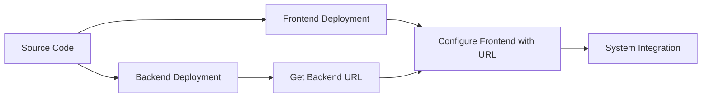

# Quickstart: Documentation Enhancement Process

## Overview
This quickstart guide provides the essential steps to enhance documentation quality by adding clear explanations, diagrams, code examples, and improved structure to existing markdown files in the /docs directory.

## Prerequisites
- Basic understanding of Markdown syntax
- Knowledge of Mermaid diagram syntax
- Access to the repository with /docs directory
- Text editor or IDE for editing markdown files

## Step-by-Step Process

### Step 1: Analyze the Documentation File
1. Open the target markdown file in /docs directory
2. Identify the main topic and purpose of the document
3. Assess current clarity, structure, and completeness
4. Note areas missing explanations, examples, or visual aids

### Step 2: Enhance Explanations
1. Add step-by-step explanations for complex processes
2. Clarify technical jargon with accessible language
3. Break down complex concepts into digestible parts
4. Add context for why certain approaches are used

### Step 3: Add Visual Elements
1. Identify concepts that would benefit from diagrams
2. Create Mermaid diagrams to illustrate relationships, processes, or flows
3. Add the diagrams using proper ```mermaid syntax
4. Provide clear descriptions for each diagram

### Step 4: Include Code Examples
1. Identify areas where code examples would enhance understanding
2. Add practical, relevant code snippets
3. Ensure code is properly formatted and tested
4. Provide explanations for what the code does

### Step 5: Improve Structure
1. Add clear headings and subheadings
2. Organize content in logical flow
3. Add summaries at the end of major sections
4. Use lists and tables for better readability

### Step 6: Review and Validate
1. Verify all enhancements align with original document intent
2. Ensure no breaking syntax was introduced
3. Confirm filenames and paths remain unchanged
4. Test that diagrams and code examples render correctly

## Example Enhancement Pattern

### Before Enhancement
```
## Deployment Process

Deploy the backend first, then the frontend. Make sure to set the correct environment variables.
```

### After Enhancement
```
## Deployment Process

This section guides you through deploying both the backend and frontend components of the system.

### Step 1: Backend Deployment
1. Prepare your backend for deployment
2. Deploy to your chosen platform (e.g., Railway)
3. Note the deployment URL for frontend configuration

### Step 2: Frontend Deployment
1. Configure environment variables with backend URL
2. Deploy frontend to static hosting (e.g., Vercel)
3. Verify integration between components



*Diagram showing the deployment flow from source code to integrated system.*

### Configuration Example
```bash
# Environment variable setup
REACT_APP_BACKEND_URL=https://your-backend-app.up.railway.app
```

This configuration allows the frontend to communicate with your deployed backend API.
```

## Quality Checks
- [ ] Explanations are clear and accessible
- [ ] Diagrams are relevant and properly formatted
- [ ] Code examples are practical and tested
- [ ] Structure improves readability
- [ ] Original intent preserved
- [ ] No syntax errors introduced
- [ ] File paths unchanged